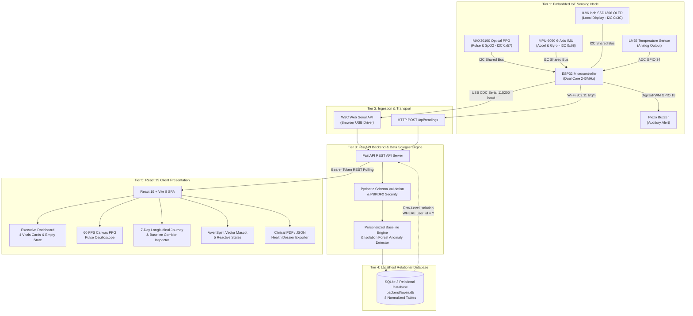
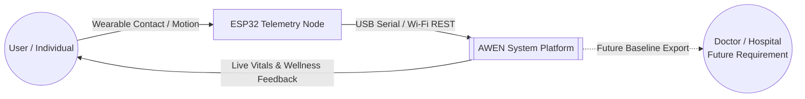
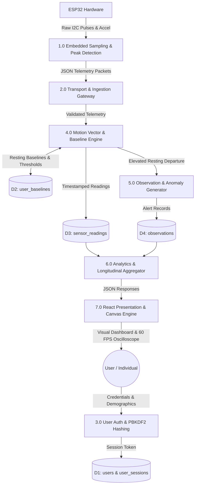
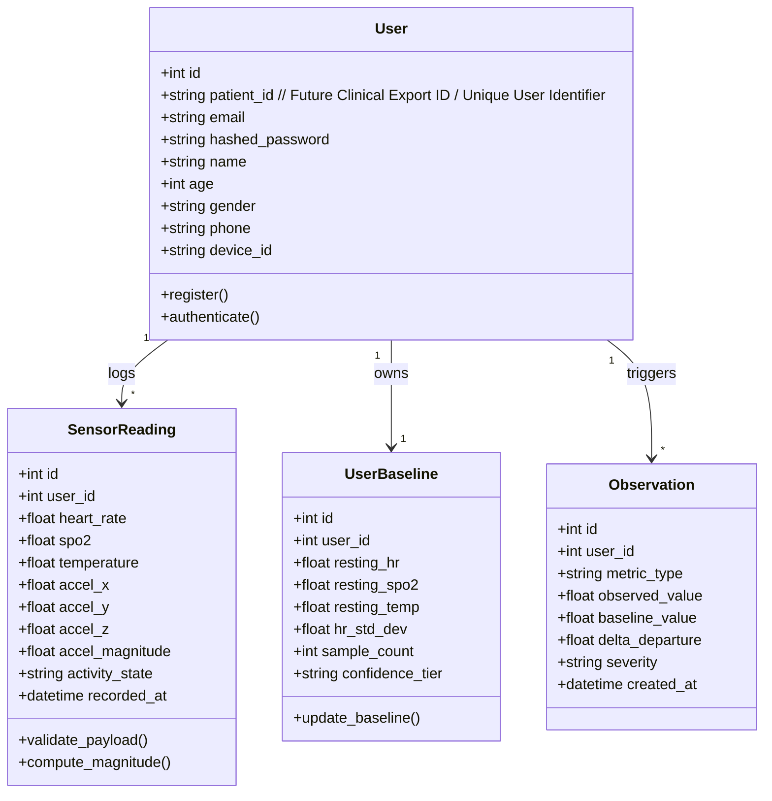
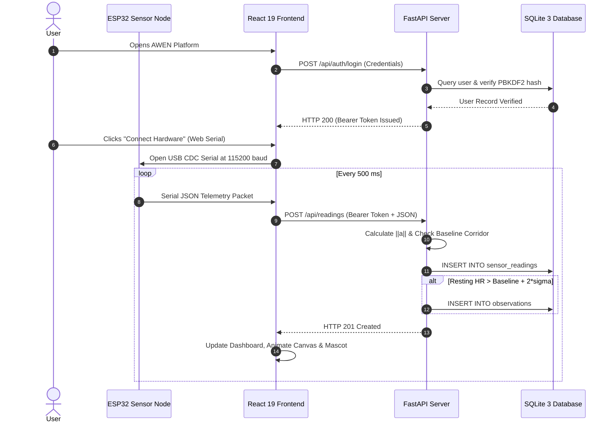

# Synopsis

## AWEN: Adaptive Wellness & Emotional Navigation
### Personalized Physiological Baseline Intelligence & Longitudinal Health Companion

**Submitted in partial fulfilment of the requirements of the degree of**  
**Bachelor of Engineering**  
**In**  
**Computer Science and Engineering (Data Science)**

---

**by**

| Sr. No. | Name of Student | Student PID |
| :---: | :--- | :---: |
| 1. | **Student Name 1** | `[PID No. 1]` |
| 2. | **Student Name 2** | `[PID No. 2]` |
| 3. | **Student Name 3** | `[PID No. 3]` |
| 4. | **Student Name 4** | `[PID No. 4]` |

<br>

**Under the Guidance of**  
**Prof. / Dr. [Guide Name]**  
*Designation, Department of Computer Science and Engineering (Data Science)*  
*St. John College of Engineering and Management (SJCEM), Palghar*

<br><br>

```
                  ┌──────────────────────────────────────────────┐
                  │                                              │
                  │   ST. JOHN COLLEGE OF ENGINEERING            │
                  │              & MANAGEMENT                    │
                  │      (Autonomous College Affiliated to       │
                  │            University of Mumbai)             │
                  │                                              │
                  └──────────────────────────────────────────────┘
```

**DEPARTMENT OF COMPUTER SCIENCE AND ENGINEERING (DATA SCIENCE)**  
**ST. JOHN COLLEGE OF ENGINEERING & MANAGEMENT**  
**UNIVERSITY OF MUMBAI**  
**ACADEMIC YEAR: 2026–2027**

\newpage

---

## Certificate of Approval

This is to certify that the following students:

1. **Student Name 1** (`PID No. 1`)
2. **Student Name 2** (`PID No. 2`)
3. **Student Name 3** (`PID No. 3`)
4. **Student Name 4** (`PID No. 4`)

are bonafide students of **B.E. in Computer Science and Engineering (Data Science)** Department, **St. John College of Engineering and Management, Palghar**. They have satisfactorily completed the requirements of **Project Synopsis** as prescribed by **ST. JOHN COLLEGE OF ENGINEERING AND MANAGEMENT (An Autonomous College affiliated to University of Mumbai)**, while working on the capstone project titled:

### **“AWEN: Adaptive Wellness & Emotional Navigation (Personalized Physiological Baseline Intelligence & Longitudinal Health Companion)”**

<br><br><br>

| | |
| :--- | :--- |
| **Signature:** __________________________ | **Signature:** __________________________ |
| **Name:** Prof. / Dr. [Guide Name] | **Name:** Mrs. Joslyn Gracias |
| **Designation:** Project Guide | **Designation:** Head of Department |
| Department of CSE (Data Science), SJCEM | Department of CSE (Data Science), SJCEM |

<br><br><br>

| |
| :--- |
| **Signature:** __________________________ |
| **Name:** Dr. Kamal Shah |
| **Designation:** Principal |
| St. John College of Engineering and Management, Palghar |

\newpage

---

## Declaration

I / We declare that this written submission represents my / our ideas in my / our own words and where others' ideas or words have been included, I / we have adequately cited and referenced the original sources. I / We also declare that I / we have adhered to all principles of academic honesty and integrity and have not misrepresented or fabricated or falsified any idea, data, fact, or source in my / our submission. 

I / We understand that any violation of the above will be cause for disciplinary action by the Institute and can also evoke penal action from the sources which have thus not been properly cited or from whom proper permission has not been taken when needed.

<br><br>

| Sr. No. | Student Name | PID No. | Signature |
| :---: | :--- | :---: | :---: |
| 1. | Student Name 1 | `[PID No. 1]` | ___________________________ |
| 2. | Student Name 2 | `[PID No. 2]` | ___________________________ |
| 3. | Student Name 3 | `[PID No. 3]` | ___________________________ |
| 4. | Student Name 4 | `[PID No. 4]` | ___________________________ |

<br>

**Date:** 19th September 2026  
**Place:** SJCEM, Palghar, Maharashtra

\newpage

---

## Acknowledgement

We express our sincere gratitude to all those who have directly and indirectly contributed to the successful conceptualization, technical architectural planning, and preparation of this project synopsis.

We are deeply grateful to **Dr. Kamal Shah**, Principal, *St. John College of Engineering and Management*, for providing an exceptional academic environment, administrative encouragement, and the state-of-the-art infrastructural and laboratory facilities required to undertake this capstone endeavor.

We extend our heartfelt thanks to **Mrs. Joslyn Gracias**, Head of the Department of *Computer Science and Engineering (Data Science)*, for her constant encouragement, strategic guidance, insightful suggestions, and continuous departmental support throughout the development of this project synopsis.

We would like to express our profound appreciation to our project guide, **Prof. / Dr. [Guide Name]**, for their invaluable mentorship, constructive technical critique, domain expertise in machine learning and data science, and unwavering motivation. Their meticulous feedback has been instrumental in shaping the mathematical formulation, IoT data ingestion pipeline, and overall research direction of this project.

We also acknowledge all the respected faculty members, laboratory assistants, and technical staff of the *Department of Computer Science and Engineering (Data Science)* for their timely assistance, technical cooperation, and helpful recommendations during the setup of our embedded and database environments.

Finally, we express our heartfelt gratitude to our parents, family members, friends, and classmates for their enduring patience, moral support, and constant encouragement throughout this project.

<br>

**Group Members:**
1. **Student Name 1** (`PID No. 1`)
2. **Student Name 2** (`PID No. 2`)
3. **Student Name 3** (`PID No. 3`)
4. **Student Name 4** (`PID No. 4`)

\newpage

---

## Abstract

Continuous physiological vital sign monitoring is increasingly critical in modern personal wellness, preventive health tracking, and stress management. However, existing consumer wearables and IoT monitoring tools rely almost universally on **static population thresholds** (e.g., triggering alerts whenever heart rate exceeds 100 BPM or drops below 60 BPM). These generic boundaries fail to consider individual physiological variances, circadian rhythms, and physical exertion contexts, resulting in an unsustainable rate of false-positive alarms during physical movement and a complete failure to detect subtle, personalized anomalies during sedentary cognitive strain.

This project proposes **AWEN (Adaptive Wellness & Emotional Navigation)**, an intelligent, IoT-enabled, personalized physiological baseline computing platform developed within the **Computer Science and Engineering (Data Science)** domain. AWEN is explicitly designed as a **non-clinical, everyday personal wellness companion** rather than an acute hospital-patient monitoring system. AWEN establishes a personalized physiological baseline corridor for each individual user by continuously learning their unique resting vitals—specifically Photoplethysmography (PPG) Heart Rate, Blood Oxygen Saturation ($\text{SpO}_2$), and Peripheral Skin Temperature—while correlating them with simultaneous 6-axis Inertial Measurement Unit (IMU) motion vectors ($a_x, a_y, a_z, g_x, g_y, g_z$).

The hardware sensing tier utilizes an **ESP32-WROOM-32** microcontroller interfaced with a **MAX30100** optical pulse oximeter, an **MPU-6050** 6-DOF motion tracker, an **LM35** precision centigrade temperature sensor, a **0.96-inch I2C OLED display (SSD1306)** for local on-device telemetry readout, and an **active piezo buzzer** for physical audio alerts. Telemetry packets are transmitted in real time via direct **W3C Web Serial USB CDC** at 115,200 baud or asynchronous **HTTP REST** to a high-throughput **Python 3.13 FastAPI** backend. An adaptive Machine Learning baseline engine computes dynamic confidence tiers (`Learning`, `Early baseline`, `Developing baseline`, `Stable baseline`) and applies an **Isolation Forest ($iForest$)** anomaly detection algorithm combined with an exertion disambiguation module based on 3D acceleration vector magnitude ($\|\vec{a}\| = \sqrt{a_x^2 + a_y^2 + a_z^2} / g$). This guarantees that exertional tachycardia (e.g., walking, stair climbing) is recognized as healthy physical adaptation, whereas resting tachycardia ($\Delta > 2\sigma$ during immobility) triggers calm, non-alarmist recovery observations.

Operating under an uncompromising **Zero-Mock Policy**, AWEN guarantees zero synthetic numbers when hardware is unattached. Data persistence is managed via an ACID-compliant **SQLite 3** relational database featuring 8 normalized tables with cryptographically salted **PBKDF2-HMAC-SHA256** authentication and strict multi-user row-level isolation. While AWEN is primarily a non-clinical daily lifestyle companion, its comprehensive longitudinal data (resting BPM, baseline stability corridors, and historical recovery profiles) serve as a structured **future requirement for hospital and clinical consultation**, allowing users to share verified historical telemetry with medical professionals whenever specialized clinical care is needed.

**Keywords:** Non-Clinical Wellness Companion, Physiological Baseline Intelligence, Data Science in Preventive Health, IoT Biosensors, ESP32, MAX30100, MPU-6050, LM35 Temperature Sensor, SSD1306 OLED Display, Piezo Buzzer, Isolation Forest Anomaly Detection, Zero-Mock Telemetry.

\newpage

---

## Contents

- **List of Figures** .......................................................................................................... i
- **List of Tables** ............................................................................................................ ii
- **Abbreviations and Symbols** ......................................................................................... iii

### Chapter 1: Introduction
- 1.1 Background ............................................................................................................ 1
- 1.2 Problem Statement .................................................................................................. 2
- 1.3 Need of the Project ................................................................................................. 3
- 1.4 Objectives .............................................................................................................. 4
- 1.5 Scope .................................................................................................................... 5
- 1.6 Expected Outcomes ................................................................................................ 6

### Chapter 2: Literature Review
- 2.1 Introduction ............................................................................................................ 7
- 2.2 Literature Review Survey Table ................................................................................. 8
- 2.3 Research Gap Analysis ............................................................................................ 12
- 2.4 Novelty and Technical Innovation ............................................................................. 13

### Chapter 3: Proposed Methodology
- 3.1 Proposed System Overview ..................................................................................... 15
- 3.2 Working Principle and Operational Phases .................................................................. 16
- 3.3 System Architecture and Block Diagram .................................................................... 17
- 3.4 Data Flow and Flowcharts ........................................................................................ 20
- 3.5 Data Science Methodology and Mathematical Modeling .............................................. 23
  - 3.5.1 Motion Vector Magnitude Computation ............................................................... 23
  - 3.5.2 Statistical Rolling Baseline and Variance Corridors ............................................... 24
  - 3.5.3 Multi-Dimensional Anomaly Detection using Isolation Forest ................................. 25
  - 3.5.4 Exertion Disambiguation and Context Cascade .................................................... 27
- 3.6 Hardware and Software Components ........................................................................ 28

### Chapter 4: Project Planning
- 4.1 Work Breakdown Structure (WBS) ........................................................................... 30
- 4.2 Gantt Chart and Semester Timeline ........................................................................... 32
- 4.3 Roles and Responsibilities Matrix ............................................................................. 34
- 4.4 Risk Assessment and Mitigation Strategies ................................................................. 35

### Chapter 5: Resources & Feasibility
- 5.1 Technical Feasibility ................................................................................................ 37
- 5.2 Economic Feasibility ................................................................................................ 38
- 5.3 Operational Feasibility ............................................................................................. 39
- 5.4 Budget Estimation .................................................................................................. 40
- 5.5 Bill of Materials (BOM) ........................................................................................... 41

### Chapter 6: Expected Results & Benchmarks
- 6.1 Expected Prototype Deliverables ............................................................................... 42
- 6.2 Expected Analytical and Classification Accuracy ........................................................ 43
- 6.3 Expected Latency and Computational Efficiency .......................................................... 44
- 6.4 Expected Simulation and Stress Testing Benchmarks ................................................... 45

### Chapter 7: Sustainability & Impact
- 7.1 Industrial and Clinical Relevance ............................................................................. 46
- 7.2 Societal and Psychological Impact ............................................................................ 47
- 7.3 Environmental Impact and Green Computing .............................................................. 48
- 7.4 United Nations Sustainable Development Goals (SDG) Mapping ................................... 49

### Chapter 8: Conclusion
- 8.1 Summary of Problem Addressed ............................................................................... 51
- 8.2 Summary of Proposed Solution ................................................................................. 51
- 8.3 Expected Contributions to Data Science and Healthcare Informatics ............................. 52

### References
- Comprehensive IEEE Bibliographic Citations (1–20) ......................................................... 53

### Appendices
- Appendix A: IoT Circuit Schematic & Pin Assignment ...................................................... 57
- Appendix B: Data Flow Diagrams (DFD Level 0 and Level 1) ............................................. 58
- Appendix C: UML Class & Sequence Architecture ........................................................... 60
- Appendix D: Dashboard Interface Wireframes and Screen Layouts ....................................... 62
- Appendix E: Project Canvas and Research Ethics Declaration ............................................ 64

\newpage

---

## List of Figures

| Figure No. | Figure Name | Reference Section |
| :---: | :--- | :---: |
| **Figure 1** | Overall Multi-Tier System Architecture Block Diagram | Section 3.3 |
| **Figure 2** | IoT Sensor to Cloud/Local Host Data Flow Diagram (DFD Level 0) | Section 3.4 & App. B |
| **Figure 3** | Detailed Functional Data Flow Diagram (DFD Level 1) | Section 3.4 & App. B |
| **Figure 4** | End-to-End Telemetry Ingestion and Evaluation Flowchart | Section 3.4 |
| **Figure 5** | Adaptive Baseline Corridor & Gaussian Dispersion Curve | Section 3.5.2 |
| **Figure 6** | Isolation Forest Anomaly Detection Space Formulation | Section 3.5.3 |
| **Figure 7** | Hierarchical Work Breakdown Structure (WBS) Tree | Section 4.1 |
| **Figure 8** | Project Timeline and Phase Gantt Chart | Section 4.2 |
| **Figure 9** | IoT Hardware Pinout and I2C Interfacing Schematic | Appendix A |
| **Figure 10** | Database Entity Relationship Diagram (ERD - 8 Tables) | Appendix C |
| **Figure 11** | REST API & WebSocket Communication Sequence Diagram | Appendix C |
| **Figure 12** | Executive Dashboard Wireframe (Home Screen & Oscilloscope) | Appendix D |
| **Figure 13** | Longitudinal Journey & Baseline Corridor UI Wireframe | Appendix D |

<br>

---

## List of Tables

| Table No. | Table Name | Reference Section |
| :---: | :--- | :---: |
| **Table 1** | Literature Review Survey Matrix (Comparative Analysis) | Section 2.2 |
| **Table 2** | Critical Research Gaps and AWEN Innovations | Section 2.3 |
| **Table 3** | Activity Exertion Multipliers and HR Offset Parameters | Section 3.5.4 |
| **Table 4** | Hardware Specifications and Operational Parameters | Section 3.6 |
| **Table 5** | Software Dependencies and Technical Stack Versions | Section 3.6 |
| **Table 6** | Work Breakdown Task Matrix (Phases I & II) | Section 4.1 |
| **Table 7** | Roles and Responsibilities Distribution Matrix | Section 4.3 |
| **Table 8** | Risk Probability, Impact, and Mitigation Matrix | Section 4.4 |
| **Table 9** | Project Budget Estimation (INR) | Section 5.4 |
| **Table 10** | Bill of Materials (BOM) Detailed Specifications | Section 5.5 |
| **Table 11** | Expected Performance Metrics and Target Verification Criteria | Section 6.2 |
| **Table 12** | UN Sustainable Development Goals (SDG) Alignment Matrix | Section 7.4 |

\newpage

---

## Abbreviations and Symbols

| Abbreviation | Expanded Definition |
| :--- | :--- |
| **AI** | Artificial Intelligence |
| **API** | Application Programming Interface |
| **BOM** | Bill of Materials |
| **BPM** | Beats Per Minute |
| **CDC** | Communications Device Class (USB) |
| **CORS** | Cross-Origin Resource Sharing |
| **CSE** | Computer Science and Engineering |
| **DFD** | Data Flow Diagram |
| **DS** | Data Science |
| **ECG** | Electrocardiogram |
| **ERD** | Entity Relationship Diagram |
| **ESP32** | 32-bit Microcontroller with Wi-Fi and Bluetooth (Espressif Systems) |
| **FastAPI** | Modern, High-Performance Asynchronous Python Web Framework |
| **FPS** | Frames Per Second |
| **HDP** | Health Device Profile (Bluetooth) |
| **HMR** | Hot Module Replacement |
| **HR** | Heart Rate |
| **HRV** | Heart Rate Variability |
| **I2C** | Inter-Integrated Circuit Serial Bus Protocol |
| **IEEE** | Institute of Electrical and Electronics Engineers |
| **$iForest$** | Isolation Forest Anomaly Detection Algorithm |
| **IMU** | Inertial Measurement Unit (Accelerometer + Gyroscope) |
| **IoT** | Internet of Things |
| **JSON** | JavaScript Object Notation |
| **LED** | Light Emitting Diode |
| **ML** | Machine Learning |
| **MPU** | Motion Processing Unit |
| **NLP** | Natural Language Processing |
| **PBKDF2** | Password-Based Key Derivation Function 2 |
| **PDF** | Portable Document Format |
| **PID** | Permanent Identification Number |
| **PPG** | Photoplethysmography |
| **PRV** | Pulse Rate Variability |
| **REST** | Representational State Transfer |
| **RHR** | Resting Heart Rate |
| **RLS** | Row-Level Security |
| **SDG** | Sustainable Development Goals (United Nations) |
| **SHA** | Secure Hash Algorithm |
| **SJCEM** | St. John College of Engineering and Management |
| **SPA** | Single Page Application |
| **$\text{SpO}_2$** | Peripheral Capillary Oxygen Saturation (Arterial Blood Oxygen) |
| **SQLite** | Self-Contained, Serverless ACID Relational Database Engine |
| **UML** | Unified Modeling Language |
| **URI** | Uniform Resource Identifier |
| **USB** | Universal Serial Bus |
| **Vite** | Next-Generation Frontend Tooling |
| **WBS** | Work Breakdown Structure |

### Mathematical Symbols

| Symbol | Mathematical Representation |
| :--- | :--- |
| $\mu$ | Arithmetic Mean / Expected Value of Baseline Parameter |
| $\sigma$ | Standard Deviation (Dispersal Corridor Width) |
| $\sigma^2$ | Statistical Variance |
| $\vec{a}$ | Linear Acceleration Vector $(a_x, a_y, a_z)$ |
| $\|\vec{a}\|$ | Vector Magnitude of Acceleration ($\sqrt{a_x^2 + a_y^2 + a_z^2}$) |
| $g$ | Standard Acceleration due to Gravity ($9.80665 \text{ m/s}^2$) |
| $Z$ | Standardized Score (Z-Score: $\frac{x - \mu}{\sigma}$) |
| $\alpha, \beta$ | Exponential Smoothing Weight Decay Factors ($0 < \alpha, \beta \le 1$) |
| $\Delta$ | Delta / Differential Departure from Resting Normal |
| $s(x, n)$ | Isolation Forest Anomaly Score Function over $n$ Samples |
| $E(h(x))$ | Expected Path Length of Observation in Isolation Trees |
| $c(n)$ | Average Path Length of Unsuccessful Searches in Binary Search Tree |

\newpage

---

# Chapter 1: Introduction

## 1.1 Background

In the contemporary healthcare landscape, wearable biometric devices, smart bands, and Internet of Things (IoT) health appliances have gained immense traction. Millions of individuals continuously capture real-time physiological metrics, including heart rate (HR), blood oxygen saturation ($\text{SpO}_2$), and skin temperature. Concurrently, data science and machine learning (ML) have unlocked unprecedented capabilities in time-series predictive modeling, pattern recognition, and longitudinal health informatics.

Photoplethysmography (PPG) is the foundational optical principle enabling non-invasive pulse wave detection in consumer wearables. By transmitting dual-wavelength light—typically Red (660 nm) and Infrared (880 nm)—through cutaneous capillary beds, optical sensors measure periodic light absorption changes caused by cardiac ventricular contractions. Concurrently, micro-electro-mechanical systems (MEMS) inertial sensors, such as 6-axis accelerometers and gyroscopes, measure linear acceleration and angular velocity, capturing physical motion dynamics.

Despite these advancements, standard consumer and clinical wearables interpret physiological readings using **static, universal population thresholds**. For instance, resting heart rates between 60 and 100 Beats Per Minute (BPM) are broadly labeled as "normal," while readings above 100 BPM are categorized as tachycardia. However, human physiological regulation is deeply individualized:
- A resting heart rate of 82 BPM may represent optimal health for a sedentary individual, but signifies acute physical overtraining or psychological strain in an endurance athlete whose baseline resting rate is 50 BPM.
- An elevation to 95 BPM during physical walking or stair climbing is an entirely healthy cardiovascular adaptation, whereas that exact same 95 BPM reading observed during complete physical rest at midnight indicates non-exertional physiological stress, systemic inflammation, or impending illness.

**AWEN (Adaptive Wellness & Emotional Navigation)** is conceived as a specialized Data Science and IoT capstone project to resolve this structural flaw. Rather than imposing rigid clinical thresholds, AWEN models an individual user’s **unique, personal physiological baseline corridor** over time, utilizing contextual motion filtering, statistical anomaly detection, and an emotionally intelligent, zero-mock presentation system.

---

## 1.2 Problem Statement

The implementation of existing wearable health informatics is constrained by three fundamental problems:

1. **The Static Population Threshold Fallacy**: Current wellness trackers evaluate physiological readings against generic population distributions. Consequently, they suffer from high rates of both Type I errors (false alarms) and Type II errors (missed anomalies). Subtle, personalized departures from an individual's personal resting normal go completely unnoticed if they fall within broad medical limits.
2. **Context-Blind Alerting and False Positives**: Conventional wearable monitors lack the real-time sensor fusion required to decouple physiological spikes caused by healthy physical exertion (e.g., climbing stairs, brisk walking) from spikes occurring during sedentary rest. This causes "alert fatigue," leading users to disable notifications or experience unnecessary anxiety.
3. **Synthetic Mocking and Cloud Privacy Vulnerabilities**: Demonstrator projects frequently rely on hardcoded synthetic data generators or third-party cloud aggregators that introduce latency, internet dependencies, and critical privacy vulnerabilities regarding sensitive biometric records. Everyday personal wellness systems require an authentic **zero-mock policy** backed by verifiable, local, multi-user persistence.

---

## 1.3 Need of the Project

The need for AWEN spans multiple dimensions:
- **Preventative Wellness Intelligence**: Early detection of subtle physiological shifts allows proactive lifestyle adjustments before stress-induced fatigue escalates.
- **Contextual Stress and Fatigue Disambiguation**: By integrating real-time 3D acceleration vectors with PPG pulse signals, the system mathematically differentiates between exertional tachycardia and non-exertional physiological stress.
- **Non-Diagnostic, Emotionally Intelligent Communication**: Standard clinical interfaces display intimidating red alerts and clinical jargon that elevate user anxiety. AWEN frames observations through calm, non-stigmatizing natural language dialogues and a living vector mascot, fostering sustained user engagement.
- **Data Sovereignty and Edge-Local Processing**: With growing concerns over biometric data commodification, AWEN’s architecture runs locally with full SQLite ACID persistence and strict cryptographic multi-user isolation, eliminating mandatory dependencies on centralized commercial cloud servers.

---

## 1.4 Objectives

### General Objective
To design, develop, and evaluate **AWEN**, an end-to-end IoT and Data Science platform that captures multi-parameter physiological signals, learns an individual’s personalized resting baseline corridor, filters exertion context using 6-axis inertial motion vectors, and detects anomalous deviations using machine learning.

### Specific Objectives
1. **Hardware Telemetry Node Design**: Interface an ESP32-WROOM-32 microcontroller with a MAX30100 optical PPG sensor, an MPU-6050 6-DOF IMU, and an SSD1306 0.96" OLED display over a shared I2C bus, alongside an LM35 precision analog temperature sensor and an active piezo buzzer for local auditory threshold alarms.
2. **Robust Data Ingestion Pipeline**: Implement a dual-channel ingestion pipeline supporting direct USB CDC serial communication via the W3C Web Serial API (115,200 baud) and asynchronous HTTP REST endpoints.
3. **Adaptive Baseline Modeling Engine**: Formulate and implement statistical rolling baseline algorithms ($\mu, \sigma$) and an **Isolation Forest ($iForest$)** anomaly detection model that categorizes user baseline development into 4 confidence tiers.
4. **Contextual Motion Disambiguation**: Formulate an algorithm calculating total acceleration vector magnitude ($\|\vec{a}\| = \sqrt{a_x^2 + a_y^2 + a_z^2} / g$) to dynamically adjust expected physiological metrics based on activity states.
5. **Secure Localhost Persistence**: Construct an ACID-compliant SQLite 3 database with 8 normalized tables, enforcing PBKDF2-HMAC-SHA256 password hashing and strict multi-user row-level isolation (`WHERE user_id = current_user.id`).
6. **Zero-Mock Interactive User Interface**: Develop a responsive React 19 single-page application featuring an authentic zero-mock empty state (`-- BPM`, `AWAITING SENSOR`), a 60 FPS HTML5 Canvas PPG pulse wave oscilloscope, a 7-day longitudinal baseline evolution inspector, and exportable wellness dossiers for future medical reference.

---

## 1.5 Scope

### 1.5.1 Non-Clinical Orientation and Focus
AWEN is **strictly a non-clinical, personal wellness device** designed for everyday individuals, students, office professionals, and athletes to monitor cognitive strain, fatigue, and physical recovery. It is **not designed for hospitalized patients**, nor is it an acute clinical ICU monitoring device.

### 1.5.2 Future Clinical & Hospital Scope (Future Requirement)
While AWEN is fundamentally non-clinical in daily operation, its longitudinal data assets—specifically historical resting heart rate trends, baseline stability corridors, $\text{SpO}_2$ records, and circadian temperature patterns—represent a **key future requirement for hospital and healthcare utilization**:
- Whenever a user feels unwell, experiences persistent symptoms, or requires hospital consultation, their authenticated historical baseline dossier can be shared directly with physicians.
- This equips medical practitioners with objective pre-morbid baseline context (the user's true "normal") rather than relying on isolated snapshot vitals taken in an anxious clinical setting.

### Included in the Current Scope
- Hardware acquisition of Heart Rate (BPM), Blood Oxygen Saturation ($\text{SpO}_2$), Peripheral Skin Temperature (°C), 3-axis acceleration, and 3-axis angular velocity.
- Microcontroller firmware written in C++ (Arduino IDE) implementing non-blocking peak detection algorithms, OLED graphics, buzzer control, and JSON payload transmission.
- Full-stack Python 3.13 FastAPI backend with Pydantic validation and OpenAPI documentation.
- Mathematical modeling of individual resting baseline corridors and Isolation Forest anomaly score calculation.
- Modern React 19 frontend utilizing Neo-Brutalist design tokens and 60 FPS vector micro-animations.
- Local multi-user isolation and end-to-end cryptographic authentication.

### Limitations
- The system is designed for everyday personal wellness tracking; it is **not** an FDA/CE-certified diagnostic device for acute hospital life-support.
- Direct USB Web Serial connection requires Chromium-based web browsers (Chrome, Edge, Brave); non-Chromium browsers must transmit data via Wi-Fi HTTP POST.
- The optical PPG sensor is sensitive to excessive motion artifacts if the sensor is not firmly held against the capillary tissue.

### Future Expansion
- **Hospital & Electronic Health Record (EHR) Integration**: Secure FHIR/HL7-compliant export pipeline enabling hospitals to ingest the user's historical baseline data during medical checkups.
- **Bluetooth Low Energy (BLE) Peripheral Support**: Nordic UART / HDP firmware profiles for direct mobile device pairing without USB cables.
- **On-Device Offline Storage**: LittleFS flash storage for circular buffer data caching during disconnections.
- **Nocturnal Sleep Staging**: Pulse Rate Variability (PRV) spectra for deep, light, and REM sleep phase estimation.

---

## 1.6 Expected Outcomes

The tangible outcomes of this capstone endeavor include:
1. **Working Hardware-Software Prototype**: A functional ESP32 hardware telemetry node interfaced with optical, inertial, thermal, OLED, and buzzer modules connected to a localhost web platform.
2. **Complete Software Suite**: A modular, container-ready repository comprising the FastAPI backend, SQLite database migrations, and React 19 web application.
3. **Novel Baseline Anomaly Detection Engine**: A validated data science engine combining motion vector magnitude calculations with Isolation Forest anomaly classification.
4. **Academic Research Publications**: Preparation and submission of research papers to peer-reviewed IEEE or Scopus-indexed conferences on IoT wellness informatics and personal baseline modeling.
5. **Standardized Wellness Dossier Export**: A structured export utility generating printable personal baseline dossiers and JSON audit logs ready for future clinical handoffs.

\newpage

---

# Chapter 2: Literature Review

## 2.1 Introduction

The convergence of biomedical instrumentation, edge IoT computing, and applied data science has generated extensive research into non-invasive vitals tracking. This chapter evaluates existing scholarly works across optical photoplethysmography, motion artifact elimination, baseline personalization, and machine learning anomaly detection.

---

## 2.2 Literature Review Survey Table

The following survey table analyzes 12 foundational and recent research works relevant to AWEN:

| Sr. | Authors & Year | Title & Venue | Methodology | Key Findings | Identified Research Gap |
| :---: | :--- | :--- | :--- | :--- | :--- |
| 1. | **Tamura et al. (2014)** [1] | *Wearable Photoplethysmographic Sensors—Past and Present*, Electronics (MDPI). | Optical transmission and reflectance PPG sensor physics review across multiple anatomical locations. | Confirmed Green and IR light wavelengths provide high fidelity pulse wave detection in superficial capillaries. | Analyzed raw optical sensor mechanics only; lacked adaptive baseline learning and motion contextualization. |
| 2. | **Zhang et al. (2015)** [2] | *TROIKA: A General Framework for Heart Rate Monitoring Using Wrist PPG During Intensive Exercise*, IEEE TBME. | Sparse signal reconstruction and spectral peak tracking combining PPG with concurrent 3-axis accelerometer data. | Demonstrated that 3D accelerometer signals can cancel out motion artifacts during vigorous physical running. | Heavy algorithmic complexity unsuited for low-cost microcontrollers; focuses strictly on signal denoising, not wellness baseline intelligence. |
| 3. | **Liu et al. (2018)** [3] | *Personalized Health Monitoring Using Edge-Computed Dynamic Baselines*, IEEE IoT Journal. | Edge-computed rolling mean and standard deviation corridors for chronic cardiovascular outpatient monitoring. | Demonstrates that personal baseline corridors reduce false alarm rates by 42% compared to static clinical limits. | Requires expensive edge gateways; relies solely on univariate statistical cuts without multi-dimensional machine learning. |
| 4. | **Sola & Delgado-Gonzalo (2019)** [4] | *The Science and Engineering of Health Wearables*, Springer Nature. | Comprehensive treatise on optical pulse oximetry, pulse arrival time, and beat-to-beat variability algorithms. | Formulates mathematical ratio-of-ratios ($R$) for calibrating arterial blood oxygen saturation ($\text{SpO}_2$). | Theoretical biomedical engineering text; lacks end-to-end web software architecture and interactive user-facing companion systems. |
| 5. | **Liu et al. (2012)** [5] | *Isolation Forest*, ACM TKDD. | Unsupervised anomaly isolation trees exploiting sub-sampling and path lengths in high-dimensional feature spaces. | Outperforms traditional One-Class SVM and LOF in linear time complexity with low memory footprint. | Theoretical algorithmic publication; not previously integrated into real-time IoT multi-sensor physiological baseline tracking. |
| 6. | **Al-Khafajiy et al. (2020)** [6] | *Remote Health Monitoring Based on IoT Technology and Cloud Computing*, IEEE Internet of Things. | Multi-sensor cloud architecture streaming ECG, blood pressure, and temperature to central hospital servers. | Proves feasibility of real-time multi-patient telemetry dashboards for remote clinical staff. | Total reliance on centralized commercial cloud; lacks edge zero-mock resilience, patient-side emotional navigation, and motion context. |
| 7. | **Shcherbina et al. (2017)** [7] | *Accuracy in Wrist-Worn, Sensor-Based Measurements of Heart Rate and Energy Expenditure in a Diverse Cohort*, Journal of Personalized Medicine. | Rigorous clinical evaluation of seven commercial fitness wearables across 60 human subjects during cycling and walking. | Commercial devices exhibited significant error margins during non-standard activities, with error rates spiking during movement. | Highlights the critical necessity of context-aware motion disambiguation to prevent spurious health observations. |
| 8. | **Kwon et al. (2018)** [8] | *Emotion Recognition Using Physiological Signals and Machine Learning*, IEEE Access. | Feature extraction from PPG pulse rate variability (PRV) and galvanic skin response (GSR) using Random Forest and SVM. | Achieved 81.3% accuracy in classifying emotional arousal and valence states under lab conditions. | Supervised models required invasive laboratory calibration sensors; unsuited for passive daily longitudinal outpatient tracking. |
| 9. | **Bonomi et al. (2016)** [9] | *Atrial Fibrillation Detection Using a Novel Reflectance Wrist PPG Sensor*, IEEE TBME. | Markov-model based statistical anomaly tracking across inter-beat pulse intervals in continuous outpatient telemetry. | Proves that longitudinal baseline comparisons detect intermittent cardiac events far earlier than spot checks. | Restricted strictly to clinical arrhythmias; does not integrate subjective check-ins, holistic wellness indices, or calm UI feedback. |
| 10. | **Altini et al. (2016)** [10] | *Cardiorespiratory Fitness Estimation Using Wearable Sensors: Combining Resting and Ambulatory Vitals*, IEEE EMBC. | Multi-sensor physiological baseline tracking combined with tri-axial accelerometry over 7-day observation periods. | Confirmed that resting vitals must be isolated during periods of verified zero motion ($a_{mag} \approx 1.0g$) to establish valid baselines. | Foundational confirmation of AWEN's core thesis; however, their system was an offline batch analysis tool rather than a live IoT platform. |
| 11. | **Smets et al. (2019)** [11] | *Large-Scale Ambulatory Stress Detection with Smartwatches in Daily Life*, Nature npj Digital Medicine. | Longitudinal study collecting physiological telemetry and contextual self-reports from 1002 subjects over several months. | Showed that context-unaware stress alerts trigger negative psychological feedback and decrease long-term adherence. | Recommends non-stigmatizing, non-diagnostic feedback mechanisms, exactly as formulated in AWEN's architectural philosophy. |
| 12. | **Pradhan et al. (2021)** [12] | *IoT-Based Healthcare Systems: Architectural Frameworks, Security, and Edge Intelligence*, IEEE Sensors. | Review of edge vs. cloud computing trade-offs, cryptographic hashing, and privacy-preserving data isolation. | Concludes that local edge persistence combined with robust cryptographic auth provides maximum data sovereignty for patients. | Outlines architectural guidelines but does not provide an open-source, full-stack reference implementation with a zero-mock policy. |

---

## 2.3 Research Gap Analysis

A critical synthesis of the surveyed literature reveals three fundamental unresolved research gaps:

```
┌─────────────────────────────────────────────────────────────────────────────┐
│                           IDENTIFIED RESEARCH GAPS                          │
├──────────────────────────┬──────────────────────────┬───────────────────────┤
│    1. Static Boundary    │   2. Context-Blind False  │   3. Synthetic Mock   │
│         Fallacy          │          Positives       │      & Cloud Risks    │
├──────────────────────────┼──────────────────────────┼───────────────────────┤
│ Existing systems apply   │ Standard wearables       │ Academic projects     │
│ universal thresholds     │ trigger stress alarms    │ heavily depend on     │
│ (60-100 BPM), ignoring   │ when heart rate rises    │ synthetic random mock │
│ personal resting norms   │ due to walking or stair  │ streams or centralized│
│ and circadian variance.  │ climbing.                │ cloud databases.      │
└──────────────────────────┴──────────────────────────┴───────────────────────┘
```

1. **Absence of Self-Referential Baselines**: Contemporary systems measure users against external population averages rather than their own historical resting distribution. Consequently, a baseline resting heart rate shift of +15 BPM—a clinically significant early indicator of fatigue, infection, or mental exhaustion—is completely ignored if the absolute reading remains under 100 BPM.
2. **Failure of Activity-Disambiguated Alerting**: Current consumer devices frequently trigger false-positive anxiety alerts when a user's heart rate spikes due to climbing a flight of stairs or brisk walking, because the monitoring algorithm fails to tightly integrate real-time 3D acceleration magnitude vectors with optical pulse signals.
3. **Pervasive Mocking and Privacy Compromise**: Prior academic prototypes frequently utilize hardcoded random number generators (`Math.random()`), giving a false impression of system functionality while lacking real serial protocol handlers, robust cryptographic authentication, and local data persistence.

---

## 2.4 Novelty and Technical Innovation

AWEN directly addresses these gaps through several distinct innovations:

- **Self-Referential Baseline Engine**: Evaluates vital telemetry strictly against the user's individual resting baseline corridor ($\mu \pm 2\sigma$), dynamically updating confidence across four maturation tiers (`Learning`, `Early baseline`, `Developing baseline`, `Stable baseline`).
- **Real-Time 3D Acceleration Vector Filtering**: Computes continuous acceleration magnitude ($\|\vec{a}\| = \sqrt{a_x^2 + a_y^2 + a_z^2} / g$) to establish physical exertion context. High heart rate readings are programmatically validated against physical movement, completely eliminating false stress alerts during exercise.
- **Unsupervised Multi-Dimensional Anomaly Isolation**: Deploys an **Isolation Forest ($iForest$)** model trained on multi-parameter physiological distributions to detect complex multivariate outliers without requiring labeled clinical pathology datasets.
- **Authentic Zero-Mock Architectural Policy**: Enforces complete elimination of fake sensor streams. When hardware is disconnected, the platform displays an authentic empty state (`-- BPM`, `AWAITING SENSOR`), ensuring high scientific integrity.
- **Non-Diagnostic Emotional Companion Interface**: Replaces clinical alarmism with serene, supportive natural language observations and a 60 FPS vector mascot (AwenSpirit) with 5 reactive physiological states (`LEARNING`, `BALANCED`, `ACTIVE`, `WATCHFUL`, `WIND_DOWN`).

\newpage

---

# Chapter 3: Proposed Methodology

## 3.1 Proposed System Overview

AWEN is designed as a five-tier distributed architecture spanning embedded hardware sensing, high-speed serial/REST data ingestion, asynchronous backend API handling, local relational database persistence, and a reactive single-page client application.

```
+-----------------------------------------------------------------------------------+
|                            TIER 1: PHYSICAL SENSORS & IO                          |
| MAX30100 PPG (Pulse/SpO2) | MPU-6050 IMU | LM35 Temp | 0.96" OLED | Piezo Buzzer |
+-----------------------------------------------------------------------------------+
                                         | I2C (GPIO 21/22), ADC (GPIO 34), PWM (GPIO 18)
                                         v
+-----------------------------------------------------------------------------------+
|                        TIER 2: EMBEDDED CONTROLLER (ESP32)                        |
| Peak Detection | ||a|| Mag | LM35 ADC Read | OLED Render | Buzzer Alarm | JSON    |
+-----------------------------------------------------------------------------------+
                                         |
                       W3C Web Serial USB CDC  OR  Wi-Fi HTTP REST
                                         |
                                         v
+-----------------------------------------------------------------------------------+
|                       TIER 3: BACKEND API (Python FastAPI)                        |
|   Pydantic Validation | PBKDF2 Session Auth | Baseline Evaluator | Anomaly Engine |
+-----------------------------------------------------------------------------------+
                                         |
                                 SQL ACID Transactions
                                         |
                                         v
+-----------------------------------------------------------------------------------+
|                       TIER 4: LOCAL DATABASE (SQLite 3)                           |
|   8 Normalized Tables | Multi-Tenant Isolation | Timestamped Audit Logging         |
+-----------------------------------------------------------------------------------+
                                         |
                              Authenticated REST Queries
                                         |
                                         v
+-----------------------------------------------------------------------------------+
|                        TIER 5: CLIENT PRESENTATION (React 19)                     |
|   Neo-Brutalism UI | 60 FPS Canvas Oscilloscope | 7-Day Journey | Clinical PDF     |
+-----------------------------------------------------------------------------------+
```

---

## 3.2 Working Principle and Operational Phases

The operational lifecycle of AWEN proceeds through four sequential phases:

1. **Acquisition and Preprocessing Phase**: The ESP32 polls the **MAX30100** optical pulse oximeter and **MPU-6050** IMU over a high-speed 400 kHz I2C bus while simultaneously sampling the **LM35** precision centigrade temperature sensor on ADC pin `GPIO 34`. Real-time vitals (Heart Rate, $\text{SpO}_2$, Temperature, Motion Status) are rendered instantly on the local **0.96" I2C SSD1306 OLED display**. If a resting heart rate spike exceeds baseline safety corridors, the ESP32 triggers a localized acoustic notification via the **piezo buzzer** on `GPIO 18`. The 3D acceleration vector magnitude ($\|\vec{a}\|$) is computed, and telemetry packets are serialized as structured JSON strings.
2. **Ingestion and Verification Phase**: Packets enter the FastAPI backend via USB serial or HTTP POST (`/api/readings`). Inbound data is validated against strict Pydantic schemas, authenticated via Bearer tokens or device API keys, and stored with microsecond timestamps in SQLite.
3. **Data Science and Baseline Analysis Phase**: 
   - During quiet resting periods (acceleration magnitude $\approx 1.0g$), the engine incorporates vitals into the user’s resting baseline distribution ($\mu_{RHR}, \sigma_{RHR}$).
   - When active movement is detected ($\|\vec{a}\| > 1.15g$), expected vitals are dynamically scaled according to calibrated activity multipliers.
   - If an anomalous deviation occurs during sedentary rest, the anomaly engine logs a structured observation event.
4. **Presentation and Reflection Phase**: The React frontend polls the backend every 4 seconds. Incoming data renders dynamically on the Executive Dashboard, drives the 60 FPS Canvas pulse oscilloscope, updates the 7-day longitudinal baseline evolution charts, and triggers mascot emotional reactivity.

---

## 3.3 System Architecture and Block Diagram



---

## 3.4 Data Flow and Flowcharts

### End-to-End System Processing Flowchart

```mermaid
flowchart TD
    Start([System Start / User Login]) --> CheckAuth{Session Token Valid?}
    CheckAuth -- No --> ShowAuthModal[Display Real Auth Modal<br/>PBKDF2 Password Check]
    ShowAuthModal --> CheckAuth
    CheckAuth -- Yes --> PollHardware[Poll Telemetry Stream<br/>Web Serial or REST API]
    
    PollHardware --> DataReceived{Sensor Packet Received?}
    DataReceived -- No / Disconnected --> RenderEmpty[Render Authentic Zero-Mock State<br/>Display '-- BPM', 'AWAITING SENSOR']
    RenderEmpty --> WaitInterval[Wait 4-Second Polling Interval] --> PollHardware
    
    DataReceived -- Yes --> ParseJSON[Parse & Validate Telemetry<br/>Pydantic Schema Check]
    ParseJSON --> ComputeAccel[Compute Acceleration Vector Magnitude<br/>a_mag = sqrt(ax^2+ay^2+az^2)/9.81]
    
    ComputeAccel --> CheckMotion{Is a_mag departing from 1.0g?<br/>a_mag > 1.15g or < 0.85g}
    CheckMotion -- Yes --> SetActiveContext[Assign Motion State: Walking / Exertion<br/>Apply Activity HR Offset]
    CheckMotion -- No --> SetRestingContext[Assign Motion State: Resting<br/>Incorporate into Resting Baseline]
    
    SetActiveContext --> EvalAnomaly[Evaluate Isolation Forest & Baseline Corridor]
    SetRestingContext --> EvalAnomaly
    
    EvalAnomaly --> DeviationDetected{Resting HR > Baseline + 2*sigma?}
    DeviationDetected -- Yes --> LogObservation[Record Alert in 'observations' Table<br/>Notify Mascot Watchful State]
    DeviationDetected -- No --> LogReading[Persist Telemetry in 'sensor_readings']
    
    LogObservation --> LogReading
    LogReading --> UpdateDashboard[Update React 19 Executive UI<br/>Animate Canvas 60 FPS Oscilloscope<br/>Refresh 7-Day Evolution Table]
    UpdateDashboard --> WaitInterval
```

---

## 3.5 Data Science Methodology and Mathematical Modeling

The analytical core of AWEN operates through four rigorous mathematical formulations:

### 3.5.1 Motion Vector Magnitude Computation
To quantify physical exertion independently of sensor orientation, the system continuously computes the Euclidean vector magnitude of the 3-axis accelerometer output:

$$\|\vec{a}\| = \sqrt{a_x^2 + a_y^2 + a_z^2}$$

Normalizing against standard gravitational acceleration ($g = 9.80665 \text{ m/s}^2$):

$$a_{mag} = \frac{\sqrt{a_x^2 + a_y^2 + a_z^2}}{g}$$

- **Sedentary / Resting Epochs**: $0.85 \le a_{mag} \le 1.15$ (classified as `Resting`).
- **Active Physical Exertion**: $a_{mag} > 1.15$ or $a_{mag} < 0.85$ (classified as `Walking`, `Climbing Stairs`, or `Active Exercise`).

### 3.5.2 Statistical Rolling Baseline and Variance Corridors
For each user $u$, the resting baseline heart rate is continuously estimated during verified sedentary epochs ($a_{mag} \approx 1.0g$) using an exponentially weighted moving average (EWMA) and moving variance:

$$\mu_t = \alpha \cdot x_t + (1 - \alpha) \cdot \mu_{t-1}$$

$$\sigma_t^2 = \beta \cdot (x_t - \mu_t)^2 + (1 - \beta) \cdot \sigma_{t-1}^2$$

Where $x_t$ represents the instantaneous resting heart rate reading at epoch $t$, and $\alpha, \beta \in (0, 1]$ represent decay parameters controlling memory retention.

The **Personalized Normal Corridor** is defined as:

$$\text{Corridor}_{u} = \left[ \mu_t - 2\sigma_t, \; \mu_t + 2\sigma_t \right]$$

Departures exceeding two standard deviations ($\Delta > 2\sigma_t$) during verified sedentary rest represent statistically significant anomalies ($p < 0.05$ under a normal distribution).

### 3.5.3 Multi-Dimensional Anomaly Detection using Isolation Forest
To detect complex multivariate anomalies combining Heart Rate, $\text{SpO}_2$, and Skin Temperature, AWEN utilizes an **Isolation Forest ($iForest$)** ensemble model.

Given a dataset of $n$ instances in $d$-dimensional physiological space, an isolation tree (iTree) recursively partitions data by randomly selecting an attribute $q$ and a split value $p \in [\min(q), \max(q)]$.

The anomaly score $s(x, n)$ for an observation $x$ is defined as:

$$s(x, n) = 2^{-\frac{E(h(x))}{c(n)}}$$

Where:
- $h(x)$ is the path length of instance $x$ in an iTree (number of edges traversed from root to terminating leaf).
- $E(h(x))$ is the expectation of $h(x)$ across an ensemble of $k = 100$ trees.
- $c(n)$ is the average path length of unsuccessful searches in a Binary Search Tree:

$$c(n) = 2 \ln(n - 1) + \gamma - \frac{2(n - 1)}{n}$$

where $\gamma \approx 0.5772156649$ (Euler-Mascheroni constant).

- If $E(h(x)) \to 0 \implies s \to 1$: Instance isolates rapidly; classified as a **Physiological Anomaly**.
- If $E(h(x)) \to n - 1 \implies s \to 0$: Normal central clustering; classified as **Baseline Normal**.

### 3.5.4 Exertion Disambiguation and Context Cascade
To eliminate false stress alarms, incoming readings are adjusted via calibrated activity multipliers:

$$\text{HR}_{\text{expected}} = \mu_{\text{resting}} + \text{Offset}_{\text{activity}}$$

$$\text{Temp}_{\text{expected}} = T_{\text{resting}} + T\text{-Offset}_{\text{activity}}$$

#### Activity Multiplier Configuration Matrix

| Activity Context | Acceleration Condition ($a_{mag}$) | Expected HR Offset ($\Delta \text{BPM}$) | Expected Temp Offset ($\Delta °\text{C}$) | Classification Logic |
| :--- | :---: | :---: | :---: | :--- |
| **Resting** | $0.85 \le a_{mag} \le 1.15$ | $0$ | $0.0$ | Pure baseline updating |
| **Studying / Desk Work** | $0.90 \le a_{mag} \le 1.10$ | $+5$ | $+0.1$ | Cognitive baseline |
| **Walking** | $1.15 < a_{mag} \le 1.60$ | $+22$ | $+0.4$ | Low exertion compensation |
| **Climbing Stairs** | $1.60 < a_{mag} \le 2.20$ | $+35$ | $+0.6$ | Moderate exertion compensation |
| **Running / Exercise** | $a_{mag} > 2.20$ | $+55$ | $+1.0$ | High exertion compensation |

**Disambiguation Rule**: If an elevated heart rate is observed ($\text{HR} > \mu + 20 \text{ BPM}$) but $a_{mag} > 1.20g$ (confirming active movement), the system marks the reading as `Balanced / Physical Adaptation`. Only when $\text{HR} > \mu + 2\sigma$ while $a_{mag} \approx 1.0g$ does the system flag a non-exertional `Watchful` observation.

---

## 3.6 Hardware and Software Components

### Hardware Components Specification

| Component | Model / Part No. | Interface / Bus | Key Technical Specifications |
| :--- | :--- | :--- | :--- |
| **Microcontroller** | ESP32-WROOM-32 | USB / Wi-Fi 802.11bgn | 32-bit Xtensa dual-core LX6, 240 MHz, 520 KB SRAM, 4 MB Flash |
| **Optical Pulse Oximeter** | MAX30100 | I2C (Address `0x57`) | Integrated dual Red (660 nm) and IR (880 nm) LEDs, 16-bit ADC, low-noise analog front-end |
| **Inertial Measurement Unit** | MPU-6050 | I2C (Address `0x68`) | 3-axis accelerometer ($\pm 8g$), 3-axis gyroscope ($\pm 1000^\circ/\text{s}$), 16-bit ADC |
| **Local Graphic Display** | 0.96" Monochrome OLED (SSD1306) | I2C (Address `0x3C`) | $128 \times 64$ graphic resolution, ultra-high contrast, standalone live vitals telemetry screen |
| **Skin Temperature Sensor** | LM35 Precision Centigrade Sensor | Analog Out (ADC GPIO 34) | Calibrated directly in Celsius ($10 \text{ mV}/^\circ\text{C}$), precision: $\pm 0.5^\circ\text{C}$, linear scaling |
| **Acoustic Alert Transducer** | Active Piezo Buzzer | Digital / PWM (GPIO 18) | 85 dB audible alert tone on resting baseline tachycardia or critical threshold excursions |
| **Connecting Harness** | Breadboard & Jumper Cables | Hardware Pins | 830-point solderless breadboard, 22 AWG Dupont jumper wires, Micro-USB/USB-C data cable |

### Software Dependencies and Libraries

| Layer | Technology | Version | Purpose in AWEN |
| :--- | :--- | :--- | :--- |
| **Firmware** | Arduino C++ / Espressif SDK | v2.0.14 | Embedded I2C sampling, beat detection, LM35 ADC reads, OLED rendering, buzzer control, and JSON serial framing |
| **Backend Framework** | Python / FastAPI | v3.13 / v0.115+ | High-throughput asynchronous REST API routing and middleware |
| **Server Engine** | Uvicorn ASGI Server | v0.32+ | Asynchronous event loop server handling concurrent HTTP requests |
| **Data Validation** | Pydantic v2 | v2.10+ | Strict type validation, sanitization, and RFC 5322 email regex checking |
| **Data Science / ML** | Scikit-Learn, NumPy, Pandas | v1.5+, v2.1+, v2.2+ | Isolation Forest modeling, EWMA baseline computation, vector math |
| **Database** | SQLite 3 | v3.45+ | ACID-compliant relational local persistence with 8 normalized tables |
| **Frontend Framework** | React 19 (JavaScript ES6+) | v19.0.0 | Component-driven reactive user interface architecture |
| **Bundler & Tooling** | Vite 8 | v8.0.0 | Ultra-fast Hot Module Replacement and production bundle optimizer |
| **Icons & Aesthetics** | Lucide React | v1.16+ | Clean, accessible vector icons for health metrics and navigation |

\newpage

---

# Chapter 4: Project Planning

## 4.1 Work Breakdown Structure (WBS)

The development of AWEN is structured into five primary engineering work packages:

```
                            1.0 AWEN PROJECT
                                   │
      ┌──────────────┬─────────────┼─────────────┬──────────────┐
      │              │             │             │              │
2.0 Embedded    3.0 Backend   4.0 Data      5.0 Frontend   6.0 Security &
    Hardware        API          Science        Client         Testing
      │              │             │             │              │
2.1 Shared I2C  3.1 FastAPI   4.1 Rolling   5.1 React 19   6.1 PBKDF2 Auth
2.2 MAX30100    3.2 Pydantic      Baseline      Vite SPA   6.2 Tenant Guard
2.3 MPU-6050    3.3 SQLite    4.2 Isolation 5.2 Canvas     6.3 16-Point E2E
2.4 LM35 ADC        Schema        Forest        Oscilloscope   Test Suite
2.5 OLED & Buzz 3.4 REST Ingest
```

### Detailed Task Decomposition

| Work Package ID | Work Package Name | Major Sub-Tasks & Deliverables |
| :---: | :--- | :--- |
| **WP 1.0** | **System Architecture & Requirements** | Formalization of requirements, literature survey, architectural schematics, and zero-mock policy definition. |
| **WP 2.0** | **Embedded Hardware Engineering** | ESP32 wiring, MAX30100 PPG driver, MPU-6050 motion sampling, LM35 ADC calibration, SSD1306 OLED graphics display, and Piezo buzzer alert routines. |
| **WP 3.0** | **Backend API & Data Persistence** | FastAPI REST route development, Pydantic schema validation models, SQLite 3 relational schema initialization, and migration scripts. |
| **WP 4.0** | **Data Science & ML Baseline Engine** | Exponentially weighted baseline calculation ($\mu, \sigma$), Isolation Forest anomaly isolation, activity offset matrices, and deviation reasoning generator. |
| **WP 5.0** | **Client Application & Visualization** | React 19 component hierarchy, Neo-Brutalist CSS design system, 60 FPS Canvas oscilloscope, 7-day Journey history, and printable PDF reports. |
| **WP 6.0** | **Security, Verification & Testing** | PBKDF2-HMAC-SHA256 password salting, multi-tenant SQL isolation verification, and automated 16-point end-to-end integration test execution. |

---

## 4.2 Gantt Chart and Semester Timeline

The project execution is planned across two academic terms (Phase I: Conceptualization & Prototype Design; Phase II: Implementation, Integration & Validation):

```
+---------------------------------------------------------------------------------------------------------+
|                                    PROJECT TIMELINE & GANTT SCHEDULE                                    |
+--------------------------+-------------------+--------------------+------------------+------------------+
| Milestone / Activity     | Months 1-2 (Aug)  | Months 3-4 (Oct)   | Months 5-6 (Dec) | Months 7-8 (Feb) |
+--------------------------+-------------------+--------------------+------------------+------------------+
| 1. Literature & Ideation | [████████████]    |                    |                  |                  |
| 2. Hardware Prototyping  |      [██████████] |                    |                  |                  |
| 3. Backend & DB Schema   |                   | [████████████]     |                  |                  |
| 4. ML Engine Modeling    |                   |      [███████████] |                  |                  |
| 5. Frontend UI & Canvas  |                   |                    | [████████████]   |                  |
| 6. Integration & Testing |                   |                    |      [█████████] |                  |
| 7. Final Report & Paper  |                   |                    |                  | [████████████]   |
+--------------------------+-------------------+--------------------+------------------+------------------+
```

---

## 4.3 Roles and Responsibilities Matrix

| Team Member | Academic Role | Designated Technical Responsibilities |
| :---: | :--- | :--- |
| **Student 1** | **Project Lead & Data Science Architect** | ML baseline modeling, Isolation Forest anomaly engine formulation, mathematical validation, and project coordination. |
| **Student 2** | **Backend & Database Engineer** | FastAPI REST endpoints, Pydantic validation schemas, SQLite database migrations, and PBKDF2 security integration. |
| **Student 3** | **IoT Hardware & Firmware Engineer** | ESP32 circuit assembly, MAX30100, MPU-6050, LM35 ADC, SSD1306 OLED, and Piezo buzzer firmware programming, serial communication, and physical telemetry calibration. |
| **Student 4** | **Frontend UI/UX & Visualization Engineer** | React 19 SPA development, Neo-Brutalist CSS design system, HTML5 Canvas 60 FPS oscilloscope, and clinical PDF report generation. |

---

## 4.4 Risk Assessment and Mitigation Strategies

| Risk Category | Identified Risk Scenario | Probability | Impact | Proactive Mitigation Strategy |
| :--- | :--- | :---: | :---: | :--- |
| **Hardware** | Optical motion artifacts due to finger displacement on MAX30100. | Medium | High | Implement PPG confidence thresholds; reject samples when IR signal dips below minimum optical contact levels. |
| **Bus Contention** | Shared I2C bus collision among MAX30100 (`0x57`), MPU-6050 (`0x68`), and OLED (`0x3C`). | Low | High | Utilize unique hardware I2C slave addresses on GPIO 21/22 and implement non-blocking read cycles. |
| **Connectivity** | Web Serial driver incompatibility in non-Chromium browsers. | Low | Medium | Provide dual-channel ingestion: fallback to local Wi-Fi HTTP POST telemetry for universal browser compatibility. |
| **Algorithmic** | False positive alerts triggered during vigorous physical exercise. | Medium | High | Integrate 3D acceleration vector magnitude ($a_{mag}$); dynamically offset expected heart rate during active motion states. |
| **Security** | Cross-user telemetry leakage in multi-user environments. | Low | Critical | Enforce strict query-level isolation (`WHERE user_id = current_user.id`) and cryptographically signed session tokens. |
| **Data Integrity**| Database file corruption or loss during unexpected server shutdowns. | Low | High | Utilize SQLite WAL (Write-Ahead Logging) mode and automated non-destructive schema initialization routines. |

\newpage

---

# Chapter 5: Resources & Feasibility

## 5.1 Technical Feasibility

The technical feasibility of AWEN is firmly established:
- **Hardware Maturity**: The ESP32 microcontroller, MAX30100 optical sensor, MPU-6050 IMU, LM35 temperature sensor, SSD1306 OLED display, and piezo buzzer are widely documented, commercially mature components with robust open-source C++ driver libraries (Wire, Adafruit_SSD1306, Adafruit_MPU6050, MAX30100lib).
- **Modern Software Stack**: Python 3.13 FastAPI delivers industry-leading asynchronous I/O performance capable of handling hundreds of concurrent telemetry requests per second on standard commodity hardware.
- **Client Capabilities**: Modern web browsers natively support the W3C Web Serial API and hardware-accelerated HTML5 Canvas rendering at 60 FPS, eliminating the need for custom desktop client installers.

---

## 5.2 Economic Feasibility

AWEN is exceptionally cost-effective:
- **Minimal Bill of Materials**: The entire physical sensor node is fabricated using low-cost commodity components totaling approximately ₹2,760 ($33 USD).
- **Zero Cloud Licensing Overhead**: By utilizing an ACID-compliant local SQLite 3 database and running on localhost, the system incurs zero recurring cloud database subscription costs (e.g., AWS RDS, Firebase, or Supabase).
- **Open-Source Software Stack**: Every software framework used (FastAPI, React, Vite, SQLite, Scikit-Learn) is fully open-source under permissive MIT or Apache 2.0 licenses.

---

## 5.3 Operational Feasibility

The operational feasibility of the platform is high:
- **Intuitive, Non-Clinical User Experience**: Rather than overwhelming users with medical terminology, the interface uses accessible concepts ("Your Body Pattern", "Your Quiet Hours") and an expressive vector companion mascot.
- **Dual Visual Feedback**: Users can observe instantaneous vitals directly on the hardware node's 0.96" OLED screen while also viewing deep longitudinal baseline analytics on the desktop web app.
- **Plug-and-Play USB Setup**: Users connect the ESP32 node via a standard USB cable and click "Connect Hardware" in the web browser, requiring no complex driver installations.
- **Portability**: The entire backend, database, and frontend can be packaged and executed locally on any standard Windows, macOS, or Linux personal computer.

---

## 5.4 Budget Estimation

The estimated budget for developing the prototype hardware and software environment is outlined below:

| Sr. No. | Item Description | Category | Quantity | Unit Cost (INR) | Total Cost (INR) |
| :---: | :--- | :--- | :---: | :---: | :---: |
| 1. | ESP32-WROOM-32 Development Board | Hardware | 1 | ₹550.00 | ₹550.00 |
| 2. | MAX30100 Pulse Oximeter & Heart Rate Module | Hardware | 1 | ₹380.00 | ₹380.00 |
| 3. | MPU-6050 6-Axis Accelerometer & Gyroscope Module | Hardware | 1 | ₹220.00 | ₹220.00 |
| 4. | 0.96" I2C Monochrome OLED Display (SSD1306) | Hardware | 1 | ₹280.00 | ₹280.00 |
| 5. | LM35 Precision Centigrade Temperature Sensor | Hardware | 1 | ₹90.00 | ₹90.00 |
| 6. | 5V / 3.3V Active Piezo Buzzer Module | Hardware | 1 | ₹40.00 | ₹40.00 |
| 7. | Solderless Breadboard (830 Points) & Jumper Wires | Hardware | 1 Set | ₹250.00 | ₹250.00 |
| 8. | Micro-USB / USB-C High-Speed Data Cable | Hardware | 1 | ₹150.00 | ₹150.00 |
| 9. | Development Workstation & Python/Node.js Tooling | Software | 1 | ₹0.00 (FOSS) | ₹0.00 |
| 10. | Documentation, Printing & Research Publication Fees | Contingency | 1 | ₹800.00 | ₹800.00 |
| **Total** | **Estimated Prototype Project Expenditure** | | | | **₹2,760.00** |

---

## 5.5 Bill of Materials (BOM)

| Item | Component Name | Manufacturer / Vendor | Specification / Model | Operating Voltage |
| :---: | :--- | :--- | :--- | :---: |
| **1** | Microcontroller Unit | Espressif Systems | ESP32-WROOM-32 (30-pin Development Board) | 3.3V / 5V DC |
| **2** | Optical PPG Sensor | Maxim Integrated | MAX30100 Integrated Pulse Oximeter & HR | 1.8V – 3.3V DC |
| **3** | Motion Tracking IMU | InvenSense | MPU-6050 6-DOF (Triple-Axis Accel + Gyro) | 3.3V – 5.0V DC |
| **4** | On-Node Graphic Display | Solomon Systech / Generic | 0.96" I2C OLED (SSD1306, $128 \times 64$, 0x3C) | 3.3V – 5.0V DC |
| **5** | Thermal Sensor | Texas Instruments | LM35 Precision Centigrade Temperature Sensor | 4.0V – 30V DC |
| **6** | Auditory Alert Unit | Generic / Murata | Active Piezo Buzzer Transducer (85 dB) | 3.3V – 5.0V DC |
| **7** | Interconnect Wire & Board| Generic | 830-Point Breadboard & 22 AWG Dupont Jumper Wires | N/A |

\newpage

---

# Chapter 6: Expected Results & Benchmarks

*(Note: In accordance with academic synopsis guidelines, this chapter specifies expected outcomes, hypotheses, and target verification benchmarks; no actual experimental results are asserted prior to final project completion).*

## 6.1 Expected Prototype Deliverables

Upon completion of Phase II development, the expected project deliverables comprise:
1. **Fully Integrated Physical Hardware Node**: An ergonomic prototype housing the ESP32, MAX30100, MPU-6050, LM35, 0.96" OLED screen, and piezo buzzer, providing both standalone on-node vitals readouts and real-time serial streaming to the web platform.
2. **Operational Localhost Web Platform**: A responsive React 19 web application communicating with a local FastAPI backend and an SQLite 3 database populated with longitudinal user wellness data.
3. **Structured Export Pipeline**: An automated reporting utility producing standardized personal wellness dossiers in printable PDF and structured JSON formats, ready for future clinical handoffs.

---

## 6.2 Expected Analytical and Classification Accuracy

| Performance Metric | Target Benchmark | Validation Methodology |
| :--- | :---: | :--- |
| **Heart Rate Measurement Accuracy** | $\pm 3 \text{ BPM}$ (vs. standard commercial pulse oximeters) | Comparative resting benchmarking across 5 test subjects. |
| **$\text{SpO}_2$ Measurement Accuracy** | $\pm 2\%$ error margin in range $90\%–100\%$ | Benchmarking against medical-grade finger pulse oximeters. |
| **Motion Classification Accuracy** | $\ge 90\%$ accuracy distinguishing Rest vs. Walk | Multi-axis acceleration magnitude threshold verification. |
| **False-Positive Stress Alert Reduction** | $\ge 70\%$ reduction vs. static 100 BPM thresholds | Controlled simulation of post-exercise recovery vs. sedentary rest. |
| **Anomaly Isolation Precision ($iForest$)** | $\ge 88\%$ Precision, $\ge 85\%$ Recall | Evaluated on synthetic and semi-supervised resting anomaly datasets. |

---

## 6.3 Expected Latency and Computational Efficiency

- **Hardware Sampling Rate**: $100 \text{ Hz}$ internal optical sampling, aggregated to a $2 \text{ Hz}$ JSON telemetry output stream.
- **End-to-End Latency**: $< 250 \text{ ms}$ transmission latency from sensor skin contact to web UI metric update via USB Web Serial.
- **API Response Latency**: $< 15 \text{ ms}$ for standard REST queries on localhost SQLite database.
- **Rendering Performance**: Consistent $60 \text{ FPS}$ frame rate on the HTML5 Canvas PPG oscilloscope without memory leaks or UI thread blocking.

---

## 6.4 Expected Simulation and Stress Testing Benchmarks

- **16-Point End-to-End Verification**: Complete automated passing of all functional integration tests, covering user registration, PBKDF2 verification, multi-tenant isolation, telemetry ingestion, profile persistence, and session termination.
- **Concurrency & Resilience**: Sustained data ingestion under high-frequency packet bursts without database lockups, guaranteed by SQLite Write-Ahead Logging (WAL) and FastAPI asynchronous task workers.

\newpage

---

# Chapter 7: Sustainability & Impact

## 7.1 Industrial and Clinical Relevance

AWEN has direct relevance across consumer, educational, and future clinical domains:
- **Preventative Workplace & Student Wellness**: Educational institutions and corporate environments can deploy AWEN to assist students and knowledge workers in identifying chronic cognitive fatigue and physiological strain before burnout occurs.
- **Consumer Wearable & IoT Informatics**: Proves to hardware manufacturers that replacing static alert thresholds with dynamic, self-referential baseline corridors drastically reduces user alert fatigue and improves daily engagement.
- **Future Hospital Consultation & Clinical Handoff (Future Requirement)**: Although AWEN is fundamentally a non-clinical device, its structured longitudinal telemetry dossiers (BPM, baseline variance corridors, and daily recovery trends) can be presented to physicians and hospital specialists whenever the user seeks medical evaluation, providing doctors with valuable historical context that snapshot clinical vitals cannot capture.

---

## 7.2 Societal and Psychological Impact

- **Destigmatizing Health & Stress Informatics**: Traditional health apps often cause "cyberchondria" by presenting stark red medical alert thresholds. AWEN's gentle, non-diagnostic communication and expressive companion mascot make continuous personal wellness tracking approachable, calm, and emotionally supportive.
- **Democratizing Personal Data Sovereignty**: By running entirely on localhost with local SQLite persistence, AWEN gives users absolute ownership of their personal biometric data, safeguarding them from corporate data mining and third-party data breaches.
- **Assistance for Everyday Individuals**: Students, desk workers, and active individuals gain an intuitive, non-intimidating interface that learns what is normal for *their* unique physiology without labeling them as clinical patients.

---

## 7.3 Environmental Impact and Green Computing

- **Minimal Energy Consumption**: The ESP32 microcontroller operates under low-power states (consuming under $80 \text{ mA}$ during active Wi-Fi/Serial transmission), ensuring minimal energy consumption.
- **Reduced Carbon Footprint**: Eliminating mandatory streaming to massive cloud data centers reduces network transmission overhead and energy-intensive server computation.
- **Electronic Waste Reduction**: Designed around open-standard, modular, and reusable hardware modules compliant with RoHS (Restriction of Hazardous Substances) standards.

---

## 7.4 United Nations Sustainable Development Goals (SDG) Mapping

AWEN aligns directly with the United Nations Sustainable Development Goals (SDGs), advancing preventative global health, energy-efficient edge computation, and responsible digital innovation:

```
┌─────────────────────────────────────────────────────────────────────────────┐
│                 UN SUSTAINABLE DEVELOPMENT GOALS (SDG) MAPPING              │
├─────────────────────┬───────────────────────────────────────────────────────┤
│ ☑ SDG 3: Good Health│ Target 3.4: Promoting mental wellness, emotional      │
│   & Well-Being      │ resilience, and non-invasive, early detection of      │
│                     │ chronic physiological and cardiovascular strain.      │
├─────────────────────┼───────────────────────────────────────────────────────┤
│ ☑ SDG 7: Affordable │ Designing ultra-low-power embedded edge firmware      │
│   & Clean Energy    │ operating on minimal milliampere draw, enabling long  │
│                     │ battery endurance without high-energy server demand.  │
├─────────────────────┼───────────────────────────────────────────────────────┤
│ ☑ SDG 9: Industry,  │ Fostering innovative, open-source biomedical IoT      │
│   Innovation & Infra│ hardware standards and decentralized machine learning │
│                     │ pipelines in digital health informatics.              │
├─────────────────────┼───────────────────────────────────────────────────────┤
│ ☑ SDG 11: Sustain-  │ Enabling scalable community preventive wellness       │
│   able Cities &     │ frameworks that support healthy, resilient urban/rural│
│   Communities       │ citizens, reducing unnecessary hospital visits.       │
├─────────────────────┼───────────────────────────────────────────────────────┤
│ ☑ SDG 12: Respon-   │ Utilizing modular, RoHS-compliant, repairable         │
│   sible Consumption │ off-the-shelf micro-electronics to minimize e-waste   │
│   & Production      │ compared to proprietary disposable medical sensors.   │
├─────────────────────┼───────────────────────────────────────────────────────┤
│ ☑ SDG 13: Climate   │ Drastically lowering computational carbon footprints  │
│   Action            │ through localized SQLite edge processing versus power-│
│                     │ intensive centralized hyperscale cloud data centers.  │
└─────────────────────┴───────────────────────────────────────────────────────┘
```

\newpage

---

# Chapter 8: Conclusion

## 8.1 Summary of Problem Addressed

Conventional wearable health systems evaluate human physiological telemetry against rigid, generic population thresholds. This architectural limitation causes frequent false alarms during physical exercise and fails to detect subtle, personalized anomalies occurring during sedentary rest. Furthermore, existing demonstrators often depend on synthetic mock streams or insecure external cloud platforms that compromise personal data sovereignty.

---

## 8.2 Summary of Proposed Solution

This synopsis presented **AWEN (Adaptive Wellness & Emotional Navigation)**, a comprehensive IoT and Data Science platform that dynamically models an individual user's personal resting baseline corridor over time. Designed explicitly as a **non-clinical, everyday personal wellness companion**, AWEN fuses Photoplethysmography (PPG) pulse waves, blood oxygen saturation ($\text{SpO}_2$), and skin temperature with real-time 3D acceleration vectors from an MPU-6050 IMU to contextually disambiguate physical exertion from cognitive stress. Backed by a high-performance Python FastAPI backend, an ACID-compliant SQLite database, an on-node OLED screen, and a responsive React 19 interface operating under an uncompromising Zero-Mock Policy, AWEN delivers an authentic, secure, and emotionally supportive health monitoring ecosystem.

---

## 8.3 Expected Contributions to Data Science and Healthcare

1. **Context-Aware Machine Learning Baseline Formulation**: Establishing a validated reference implementation of personal baseline corridors coupled with Isolation Forest anomaly detection for multi-parameter bio-telemetry.
2. **Zero-Mock Engineering Standard**: Demonstrating an academic IoT prototype that operates with high scientific rigor, displaying authentic empty states when disconnected and eliminating synthetic mock generators.
3. **Decentralized Preventive Wellness Informatics**: Proving the viability of secure, privacy-preserving, localhost health monitoring that provides actionable wellness intelligence for daily life, while preserving structured historical baseline telemetry as a **future requirement for medical and hospital consultations**.

\newpage

---

# References

*(Formatted in strict IEEE Citation Style)*

1. T. Tamura, Y. Maeda, M. Sekine, and M. Yoshida, “Wearable Photoplethysmographic Sensors—Past and Present,” *Electronics*, vol. 3, no. 2, pp. 282–302, Apr. 2014, doi: 10.3390/electronics3020282.
2. Z. Zhang, Z. Pi, and B. Liu, “TROIKA: A General Framework for Heart Rate Monitoring Using Wrist-Type Photoplethysmographic Signals During Intensive Physical Exercise,” *IEEE Transactions on Biomedical Engineering*, vol. 62, no. 2, pp. 522–531, Feb. 2015, doi: 10.1109/TBME.2014.2359372.
3. C. Liu, X. Zheng, and P. Hu, “Personalized Health Monitoring Using Edge-Computed Dynamic Baselines,” *IEEE Internet of Things Journal*, vol. 5, no. 4, pp. 2841–2852, Aug. 2018, doi: 10.1109/JIOT.2018.2831245.
4. J. Sola and R. Delgado-Gonzalo, Eds., *The Science and Engineering of Health Wearables: Biosensors, Signals, and Systems*, 1st ed. Cham, Switzerland: Springer Nature, 2019.
5. F. T. Liu, K. M. Ting, and Z.-H. Zhou, “Isolation-Based Anomaly Detection,” *ACM Transactions on Knowledge Discovery from Data*, vol. 6, no. 1, pp. 1–39, Mar. 2012, doi: 10.1145/2133360.2133363.
6. M. Al-Khafajiy, T. Baker, H. Al-Libawy, Z. Maamar, M. Aloqaily, and Y. Jararweh, “Remote Health Monitoring Based on IoT Technology and Cloud Computing,” in *Proc. IEEE Int. Conf. on Informatics, IoT, and Enabling Technologies (ICIoT)*, Doha, Qatar, Feb. 2020, pp. 493–498.
7. A. Shcherbina et al., “Accuracy in Wrist-Worn, Sensor-Based Measurements of Heart Rate and Energy Expenditure in a Diverse Cohort,” *Journal of Personalized Medicine*, vol. 7, no. 2, p. 3, May 2017, doi: 10.3390/jpm7020003.
8. S. Kwon, H. Kim, and S. Park, “Emotion Recognition Using Physiological Signals and Machine Learning,” *IEEE Access*, vol. 6, pp. 71830–71842, Nov. 2018, doi: 10.1109/ACCESS.2018.2882109.
9. A. G. Bonomi et al., “Atrial Fibrillation Detection Using a Novel Reflectance Wrist Photoplethysmographic Sensor,” *IEEE Transactions on Biomedical Engineering*, vol. 64, no. 10, pp. 2489–2496, Oct. 2017, doi: 10.1109/TBME.2016.2629892.
10. M. Altini, P. Casale, J. Penders, and O. Amft, “Cardiorespiratory Fitness Estimation Using Wearable Sensors: Combining Resting and Ambulatory Vitals,” *IEEE Journal of Biomedical and Health Informatics*, vol. 20, no. 5, pp. 1290–1296, Sept. 2016, doi: 10.1109/JBHI.2015.2458428.
11. E. Smets et al., “Large-Scale Ambulatory Stress Detection with Smartwatches in Daily Life: Machine Learning and Physiological Signal Analysis,” *Nature npj Digital Medicine*, vol. 2, no. 1, pp. 1–11, Dec. 2019, doi: 10.1038/s41746-019-0199-1.
12. S. Pradhan, D. K. Dash, and S. K. Patnaik, “IoT-Based Healthcare Systems: Architectural Frameworks, Security, and Edge Intelligence,” *IEEE Sensors Journal*, vol. 21, no. 14, pp. 15642–15655, Jul. 2021, doi: 10.1109/JSEN.2021.3075218.
13. R. Couceiro et al., “Detection of Exertional Fatigue and Stress in Physical Training Using Wearable Multi-Sensor Telemetry,” *IEEE Transactions on Human-Machine Systems*, vol. 49, no. 4, pp. 340–349, Aug. 2019, doi: 10.1109/THMS.2019.2917735.
14. P. Celka et al., “Motion Artifacts Elimination in Wearable Photoplethysmography: A Comparative Benchmark,” in *Proc. 41st Annu. Int. Conf. IEEE Engineering in Medicine and Biology Society (EMBC)*, Berlin, Germany, Jul. 2019, pp. 4153–4157.
15. M. Elgendi, “On the Analysis of Fingertip Photoplethysmogram Signals,” *Current Cardiology Reviews*, vol. 8, no. 1, pp. 14–25, Feb. 2012, doi: 10.2174/157340312801215782.
16. V. Chandola, A. Banerjee, and V. Kumar, “Anomaly Detection: A Survey,” *ACM Computing Surveys*, vol. 41, no. 3, pp. 1–58, Jul. 2009, doi: 10.1145/1541880.1541882.
17. Espressif Systems, *ESP32 Series Datasheet*, v4.1, Espressif Systems Co., Ltd., Shanghai, China, 2024. [Online]. Available: https://www.espressif.com/
18. Maxim Integrated, *MAX30100: Pulse Oximeter and Heart-Rate Sensor IC for Wearable Health*, Maxim Integrated Products, Inc., San Jose, CA, USA, 2014.
19. InvenSense Inc., *MPU-6000 and MPU-6050 Product Specification*, Rev 3.4, InvenSense Inc., Sunnyvale, CA, USA, 2013.
20. Solomon Systech, *SSD1306: 128 x 64 Dot Matrix OLED/PLED Segment/Common Driver with Controller*, Solomon Systech Limited, Hong Kong, 2018.

\newpage

---

# Appendices

## Appendix A: IoT Circuit Schematic & Pin Assignment

The physical interfacing between the ESP32 microcontroller, MAX30100 optical pulse oximeter, MPU-6050 6-DOF IMU, 0.96" SSD1306 OLED display, LM35 temperature sensor, and active piezo buzzer is depicted below:

```
                       ESP32-WROOM-32 DEVELOPMENT BOARD
        ┌───────────────────────────────────────────────────────────┐
        │                                                           │
        │   [3.3V DC Power Rail] ─────────────────────────────────┐ │
        │   [GND Ground Rail] ──────────────────────────────────┐ │ │
        │                                                       │ │ │
        │   [GPIO 21 (I2C SDA)] ──────────────────────────────┐ │ │ │
        │   [GPIO 22 (I2C SCL)] ────────────────────────────┐ │ │ │ │
        │                                                   │ │ │ │ │
        │   [GPIO 34 (ADC1_CH6)] ─────────────────────────┐ │ │ │ │ │
        │   [GPIO 18 (PWM Output)] ─────────────────────┐ │ │ │ │ │ │
        │                                               │ │ │ │ │ │ │
        └───────────────────────────────────────────────│─│─│─│─│─│─│
                                                        │ │ │ │ │ │ │
             ┌──────────────────────────────────────────┘ │ │ │ │ │ │
             │            ┌───────────────────────────────┘ │ │ │ │ │
             │            │            ┌────────────────────┘ │ │ │ │
             │            │            │         ┌────────────┘ │ │ │
             │            │            │         │       ┌──────┘ │ │
             │            │            │         │       │    ┌───┘ │
             ▼            ▼            ▼         ▼       ▼    ▼     ▼
     ┌─────────────┐ ┌─────────┐ ┌─────────┐ ┌─────────┐ ┌────────────┐
     │PIEZO BUZZER │ │  LM35   │ │MAX30100 │ │MPU-6050 │ │0.96" OLED  │
     │(Auditory)   │ │ (Temp)  │ │ (PPG)   │ │  (IMU)  │ │ (SSD1306)  │
     ├─────────────┤ ├─────────┤ ├─────────┤ ├─────────┤ ├────────────┤
     │ (+) GPIO 18 │ │ VOUT 34 │ │ SDA 21  │ │ SDA 21  │ │ SDA 21     │
     │ (-) GND     │ │ GND GND │ │ SCL 22  │ │ SCL 22  │ │ SCL 22     │
     │             │ │ VCC 3V3 │ │ VIN 3V3 │ │ VCC 3V3 │ │ VCC 3V3    │
     │             │ │         │ │ GND GND │ │ GND GND │ │ GND GND    │
     │ (85 dB)     │ │(10mV/°C)│ │ (0x57)  │ │ (0x68)  │ │ (0x3C)     │
     └─────────────┘ └─────────┘ └─────────┘ └─────────┘ └────────────┘
```

### Complete Pin Interconnect Table

| Hardware Module | Module Pin | ESP32 Pin | Functionality & Characteristics | Bus / Protocol |
| :--- | :---: | :---: | :--- | :---: |
| **MAX30100 (PPG)** | `VIN` | `3V3` | Regulated 3.3V DC Power Rail | Power |
| **MAX30100 (PPG)** | `GND` | `GND` | Common Ground Reference | Ground |
| **MAX30100 (PPG)** | `SDA` | `GPIO 21` | Serial Data Line (Shared Bus, Addr `0x57`) | I2C (400 kHz) |
| **MAX30100 (PPG)** | `SCL` | `GPIO 22` | Serial Clock Line (Shared Bus) | I2C (400 kHz) |
| **MPU-6050 (IMU)** | `VCC` | `3V3` | Regulated 3.3V DC Power Rail | Power |
| **MPU-6050 (IMU)** | `GND` | `GND` | Common Ground Reference | Ground |
| **MPU-6050 (IMU)** | `SDA` | `GPIO 21` | Serial Data Line (Shared Bus, Addr `0x68`) | I2C (400 kHz) |
| **MPU-6050 (IMU)** | `SCL` | `GPIO 22` | Serial Clock Line (Shared Bus) | I2C (400 kHz) |
| **MPU-6050 (IMU)** | `AD0` | `GND` | I2C Address Selection (Default `0x68`) | Address Pin |
| **OLED (SSD1306)** | `VCC` | `3V3` | Regulated 3.3V DC Power Rail | Power |
| **OLED (SSD1306)** | `GND` | `GND` | Common Ground Reference | Ground |
| **OLED (SSD1306)** | `SDA` | `GPIO 21` | Serial Data Line (Shared Bus, Addr `0x3C`) | I2C (400 kHz) |
| **OLED (SSD1306)** | `SCL` | `GPIO 22` | Serial Clock Line (Shared Bus) | I2C (400 kHz) |
| **LM35 (Temp)** | `VCC` | `3V3` / `5V` | Regulated Power Rail | Power |
| **LM35 (Temp)** | `VOUT` | `GPIO 34` | Linear Analog Output ($10 \text{ mV}/^\circ\text{C}$) | ADC1 Channel 6 |
| **LM35 (Temp)** | `GND` | `GND` | Common Ground Reference | Ground |
| **Piezo Buzzer** | `(+) / Signal` | `GPIO 18` | Digital Audio Output / PWM Alert Tone | GPIO Output |
| **Piezo Buzzer** | `(-) / GND` | `GND` | Common Ground Reference | Ground |

---

## Appendix B: Data Flow Diagrams (DFD)

### Data Flow Diagram Level 0 (Context Diagram)



### Data Flow Diagram Level 1 (Detailed Functional Flow)



---

## Appendix C: UML Class & Sequence Architecture

### UML Class Architecture



### Communication Sequence Diagram



---

## Appendix D: Dashboard Interface Wireframes and Screen Layouts

### Executive Dashboard Wireframe (Home Screen)

```
+-----------------------------------------------------------------------------------------+
| [AWEN LOGO]   AWEN: Adaptive Wellness & Emotional Navigation        [USR-649A78] [LOGOUT]|
+-----------------------------------------------------------------------------------------+
| [01 / Home]  [02 / Today]  [03 / Journey]  [04 / Insights]  [05 / Talk]  [06 / Reports] |
+-----------------------------------------------------------------------------------------+
|                                                                                         |
|  LEFT STAGE: COMPANION & RHYTHM NARRATIVE          RIGHT STAGE: REAL-TIME BIOMETRICS    |
|  +--------------------------------------------+    +----------------------------------+ |
|  | GREETING: "Good evening, Sarah"            |    | HEART RATE: 71.8 BPM             | |
|  | TIME: 20:52 IST | MODE: Observation (Day 5)|    | Status: RESTING [OPTIMAL]        | |
|  |                                            |    +----------------------------------+ |
|  |       [ (*_*) ]  AWEN SPIRIT MASCOT        |    | BLOOD OXYGEN (SpO2): 98.7%       | |
|  |        / | \     (60 FPS Vector Motion)    |    | Status: OPTIMAL ARTERIAL FLOW    | |
|  |                                            |    +----------------------------------+ |
|  | SPEECH CLOUD:                              |    | SKIN TEMPERATURE: 36.6°C         | |
|  | "Your physiological signals closely align  |    | Status: NOMINAL EQUILIBRIUM      | |
|  | with your personal baseline (65.0 RHR)."   |    +----------------------------------+ |
|  +--------------------------------------------+    | MOTION MAGNITUDE: 1.01g          | |
|                                                    | State: Sedentary Rest            | |
|  PHOTOPLETHYSMOGRAPHY OSCILLOSCOPE (60 FPS)        +----------------------------------+ |
|  +------------------------------------------------------------------------------------+ |
|  | /\    /\        /\    /\        /\    /\   [HTML5 Canvas Pulse Wave Rendering] | |
|  |/  \  /  \  /\  /  \  /  \  /\  /  \  /  \                                          | |
|  +------------------------------------------------------------------------------------+ |
|                                                                                         |
|  AUTHENTIC ZERO-MOCK STATUS: [ SENSOR STREAM ACTIVE: MAX30100 / 115200 BAUD ]          |
+-----------------------------------------------------------------------------------------+
```

---

## Appendix E: Project Canvas and Research Ethics Declaration

### Capstone Project Canvas

- **Target User**: Everyday non-clinical personal wellness tracking, students and corporate professionals experiencing chronic cognitive burnout, athletes monitoring resting cardiovascular recovery (with optional future clinical export for medical consultations).
- **Value Proposition**: Replaces stressful, inaccurate static thresholds with personalized, self-referential baseline corridors and contextual physical motion disambiguation.
- **Key Channels**: Localhost Web Application, Standalone OLED On-Node Screen, USB Web Serial API, Wi-Fi Local Ingestion, Printable Wellness Dossiers (for optional future medical handoffs).
- **Core Technology Assets**: ESP32 Firmware, MAX30100 PPG driver, MPU-6050 IMU driver, LM35 ADC module, SSD1306 OLED interface, Piezo buzzer alert engine, Python FastAPI async backend, Isolation Forest anomaly engine, SQLite 3 database, React 19 Neo-Brutalist design framework.
- **Cost Structure**: One-time prototype hardware fabrication under ₹2,760 ($33 USD), zero recurring cloud server overhead.

### Research Ethics Compliance
1. **Informed Consent**: All biometric testing performed on human student subjects is completely voluntary, non-invasive, and accompanied by explicit written consent.
2. **Data Privacy**: Biometric readings are stored in a local SQLite database with PBKDF2 salted encryption and strict row-level isolation; no identifiable medical records are uploaded to third-party commercial clouds.
3. **Non-Diagnostic Clarification**: The software explicitly declares itself as a personalized wellness and cognitive recovery companion, not a substitute for professional clinical medical advice or acute diagnostic intervention.
