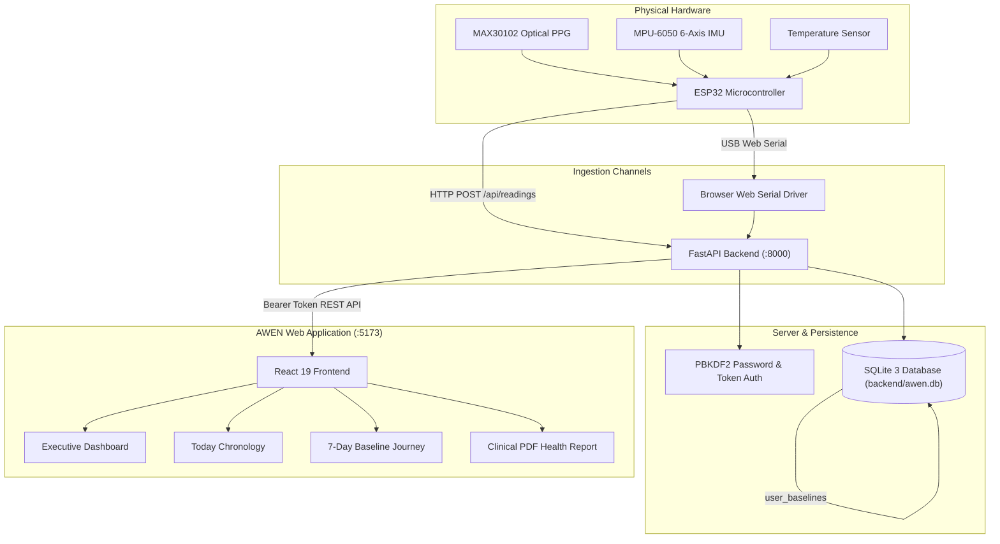

# AWEN Website — Feature & Module Overview

> **Target Audience**: Academic Evaluators, Teachers, and Technical Reviewers  
> **Application Name**: AWEN (Adaptive Wellness & Emotional Navigation)  
> **Live Localhost URL**: `http://localhost:5173` (Frontend) & `http://127.0.0.1:8000` (Backend API)  
> **Database Engine**: Local SQLite 3 (`backend/awen.db`)

---

## 1. Website Purpose

The AWEN website is a specialized physiological intelligence interface designed to display personal health telemetry evaluated against an individual's **own learned resting baseline**. 

Unlike generic health dashboards that compare every user to fixed population averages (such as flagging any heart rate over 100 BPM), AWEN contextualizes vital signs (Heart Rate, SpO₂, and Skin Temperature) alongside physical movement data from an accelerometer and gyroscope. The website provides a clean, distraction-free **Neo-Brutalist High-Contrast** presentation that emphasizes clinical clarity, authentic data integrity, and emotional calmness.

---

## 2. Main Navigation

The application features a responsive navigation system accessible via the left sidebar on desktop (w-60) and a bottom bar on mobile devices.

| Number | Name | Primary Purpose | Information Displayed | Real Backend / Database Data |
|---|---|---|---|:---:|
| **01** | **Home** | Executive Overview | 4 Biometric Metric Cards (HR, SpO₂, Temp, Activity), 60 FPS Canvas Oscilloscope, AWEN Mascot, "Your Rhythm Today" narrative card. | **YES** (SQLite `sensor_readings`) |
| **02** | **Today** | Daily Chronology & Recovery | Chronological timeline of real sensor readings, subjective daily check-in form (mood, activity tags, notes). | **YES** (SQLite `sensor_readings` & `user_checkins`) |
| **03** | **Journey** | 7-Day Baseline Evolution | 7-day daily rolling averages chart and an interactive raw SQLite table showing all stored sensor rows. | **YES** (SQLite aggregation queries) |
| **04** | **Insights** | Comparative Analytics & Dispersion | Statistical dispersion graph comparing daily resting values against learned personal baseline corridors. | **YES** (SQLite `user_baselines` & rolling history) |
| **05** | **AI Companion** | Emotional Support & Memory | Interactive conversation interface with conversational memory of previous health check-ins. | **YES** (SQLite `awen_conversations`) |
| **06** | **Reports** | Clinical Summary Export | Formatted printable clinical health report with PDF print stylesheet and structured JSON raw export. | **YES** (SQLite `users` & `sensor_readings`) |
| **07** | **Settings** | Preferences & Hardware | Display temperature units (°C/°F), 60 FPS vector animation toggle, firmware parser self-test, and marked dev tools. | **YES** (Client preferences & SQLite test baseline) |
| **Profile** | **You** | Patient Demographic Management | Permanent Patient ID (`PAT-XXXXXX`), Age, Gender, Phone, paired Device ID, with an interactive SQLite edit modal. | **YES** (SQLite `users` table) |

---

## 3. Authentication

AWEN enforces genuine authentication with zero fake fallbacks:

- **Registration Modal**: New patients register with their Full Name, Email, Password, Age, Gender, Phone, and Device ID. The backend automatically hashes the password using **PBKDF2-HMAC-SHA256** and assigns a unique `PAT-XXXXXX` patient identifier.
- **Login Modal**: Authenticates credentials against the SQLite database and issues a persistent bearer token stored in `localStorage` and recorded in the `user_sessions` table.
- **Protected Patient Session**: Unauthenticated users cannot access any dashboard view and are greeted by the Landing Page.
- **Logout Action**: Clears client storage and sends a request to `POST /api/auth/logout`, permanently invalidating the session in the database.
- **Zero Mock Policy**: Hardcoded credentials and simulated guest bypasses (`guest_demo`) are completely removed.

---

## 4. Patient Profile

Accessible via the user avatar menu or the **You** tab:

- **Displayed Information**:
  - **Patient ID**: Permanent medical record code (e.g., `PAT-649A78`).
  - **Account Email**: Login address.
  - **Age & Gender**: Demographic factors used in baseline models.
  - **Contact Phone**: Contact number.
  - **Linked Hardware ID**: Assigned ESP32 device identifier (e.g., `ESP32_SARAH_01`).
  - **Baseline Confidence**: Current calibration status (`Learning`, `Early baseline`, `Developing baseline`, `Stable baseline`).
- **Interactive Edit Modal**: Clicking **Edit Profile** opens a dialog allowing the patient to update their name, age, gender, phone, and device ID. Updates are saved immediately to SQLite via `PUT /api/user/profile`.

---

## 5. Dashboard (Home Screen)

The Executive Overview screen provides real-time physiological visibility:

### 1. Biometric Metric Cards (Top Row)
- **Heart Rate**: Displays current pulse in BPM. If no hardware is connected and no readings exist in SQLite, displays `-- BPM` with `No Signal`. When sensor data is ingested, displays the exact numerical BPM (e.g., `71.8 BPM`).
- **Blood Oxygen (SpO₂)**: Displays arterial oxygen saturation percentage (e.g., `98.7%` or `--%`).
- **Skin Temperature**: Displays peripheral temperature in Celsius or Fahrenheit (e.g., `36.6°C` or `--°C`).
- **Activity Context**: Categorizes motion into `Resting`, `Walking`, `Climbing Stairs`, or `Running` based on 3-axis accelerometer magnitude.

### 2. 60 FPS HTML5 Canvas Oscilloscope
- Simulates real photoplethysmography (PPG) pulse waves matching the patient's incoming heart rate frequency. When hardware is disconnected, renders a steady standby baseline with an `AWAITING SENSOR` indicator.

### 3. Living Vector Mascot (AWEN)
- An animated vector mascot reflecting the patient's current wellness state across 5 color themes:
  - `BALANCED`: Emerald green aura (resting within baseline).
  - `ACTIVE`: Warm golden amber (healthy movement exertion).
  - `WATCHFUL`: Soft orange (elevated heart rate while resting).
  - `WIND_DOWN`: Deep indigo (evening relaxation).
  - `LEARNING`: Soft lavender (baseline observation mode).
- Tapping the mascot displays an organic speech cloud with contextual observations.

---

## 6. Today's Data (Today Screen)

The **Today Screen** captures the chronological recovery story of the day:

- **Chronological Timeline**: Merges real sensor readings and subjective check-ins in chronological order.
- **Reading Cards**: Display timestamp, measured BPM, difference from resting baseline (e.g., `+7.8 vs base`), activity context, and device ID.
- **Daily Check-in Module**: Patients log their subjective feeling (`Great`, `Good`, `Neutral`, `Tired`, `Stressed`), select tags (`Desk Work`, `Exercise`, `Meditation`), and record notes. Saved entries persist directly to the `user_checkins` database table.

---

## 7. Journey / History Screen

The **Journey Screen** provides longitudinal health tracking:

- **7-Day Baseline Trend Chart**: Plots daily resting averages across the preceding 7 days computed directly by SQLite SQL aggregations (`AVG(heart_rate)`).
- **Interactive Day Inspection**: Clicking any day node reveals average heart rate, SpO₂, temperature, and the total sample count recorded on that day.
- **Persisted SQLite Records Table**: An interactive audit table that displays raw database rows stored in the `sensor_readings` table (Timestamp, Heart Rate, SpO₂, Temperature, Activity, Device ID, and Data Source).

---

## 8. Insights Screen

The **Insights Screen** visualizes statistical comparison:

- **Baseline Corridor Chart**: An SVG line chart showing how resting readings compare against the patient's calibrated baseline corridor (represented as a shaded tolerance band $\pm 4.8\text{ BPM}$).
- **Timeframe Selector**: Allows filtering across `24 Hours`, `7-Day Trend`, and `30-Day Trend`.
- **Empty State Guarantee**: If no historical readings exist, renders a clean `"No historical baseline data recorded yet"` message rather than fabricated data points.

---

## 9. Observations / Notifications

Located in the top-right header notification bell:

- **Real-Time Baseline Observations**: When an ingested reading detects that the patient's heart rate is elevated while their activity state is `Resting`, the backend automatically generates an observation row in the `observations` SQLite table.
- **Dropdown List**: Displays observation severity, contextual message, and time of occurrence.
- **One-Click Navigation**: Clicking an observation navigates directly to the relevant analysis tab.

---

## 10. Health Report

Accessible via the **Reports** navigation button or the user profile dropdown:

- **Printable Clinical Summary**: A document styled with clean print media queries suitable for physical printing or saving as a PDF.
- **Content**: Includes Patient ID, demographic details, resting baseline corridor values, summary narrative, and a structured audit log of recorded readings with baseline deltas.
- **Raw JSON Export**: Clicking **JSON** downloads a `.json` file containing the patient's complete database records.

---

## 11. Settings Screen

Organized into five organized sub-tabs:

1. **General & Display**: Toggle temperature display unit between Celsius (°C) and Fahrenheit (°F); toggle 60 FPS mascot animations.
2. **Baseline & Observation**: Toggle 3–7 Day Observation Mode; view current resting heart rate and sample count; access the clearly labeled `[DEV/TEST ONLY - NOT MEDICAL DATA]` calibration utility.
3. **ESP32 & Hardware**: View microcontroller hardware specifications (ESP32-WROOM-32, MAX30102, MPU-6050, 115200 baud); launch the 6-case firmware data parser verification test.
4. **Data & Storage**: Download SQLite data export; trigger printable clinical report.
5. **About & Privacy**: Review non-diagnostic wellness philosophy and sign out of the application.

---

## 12. Backend Integration

The frontend contains **zero hardcoded patient data**. All screens communicate through the unified `apiService.js` client module:

- Every data request transmits the patient's active Bearer session token.
- API base URL: `http://localhost:8000`.
- If the backend is stopped or an endpoint is unreachable, the UI gracefully displays connection status indicators rather than falling back to fake numbers.

---

## 13. Database Integration

All persistent entities reside in the local SQLite database (`backend/awen.db`):

- **Data Survives Refresh**: Reloading the browser immediately restores the active patient session and fetches the latest database state.
- **Data Survives Logout/Login**: Logging out and logging back in restores all previously recorded sensor readings, baseline calibrations, and check-in logs.
- **Data Survives Server Restart**: Stopping and restarting the FastAPI backend causes zero data loss because records reside on the local disk.

---

## 14. ESP32 Integration

The website is fully prepared to receive real physical sensor data through two redundant communication channels:

1. **Direct USB Web Serial API**: Connect the ESP32 via USB cable, click **Connect Hardware** in the hardware console, and stream live serial packets directly into the browser tab at 115,200 baud.
2. **Wi-Fi HTTP POST Ingestion**: The ESP32 posts JSON packets over local Wi-Fi to `http://<LAN_IP>:8000/api/readings`. The backend saves the readings to SQLite, and the frontend automatically displays the newest reading via its background polling loop.

---

## 15. Data Flow Diagram



---

## 16. Screens / UI Breakdown

```
AWEN Client
├── Landing Page (/)               ──> High-contrast product presentation & Sign In trigger
├── Dashboard (/home)              ──> 4 Vitals cards, 60 FPS Oscilloscope, Mascot, Narrative
├── Today Screen (/today)          ──> Daily timeline of readings + Subjective Check-in form
├── Journey Screen (/journey)      ──> 7-Day resting averages chart + Raw SQLite audit table
├── Insights Screen (/insights)    ──> Baseline tolerance corridor dispersion graph
├── AI Companion (/talk)           ──> Conversational dialogue with health context memory
├── Profile Modal (/you)           ──> Patient ID, demographics, and interactive profile editor
├── Clinical Reports (/reports)    ──> Printable health summary and raw JSON data export
├── System Settings (/settings)    ──> Display units, parser test, and dev test calibration
└── Hardware Console (Modal)       ──> ESP32 Web Serial port selector and live packet terminal
```

---

## 17. Demonstration Flow for Teacher Evaluation

To demonstrate the complete working system to your teacher, follow this step-by-step sequence:

1. **Start the FastAPI Backend**:
   ```powershell
   cd backend
   python -m uvicorn main:app --host 127.0.0.1 --port 8000 --reload
   ```
2. **Start the React Frontend**:
   ```powershell
   npm run dev
   ```
3. **Open the Web Browser**:
   Navigate to `http://localhost:5173`.
4. **Demonstrate the Landing Page**:
   Show the Neo-Brutalist design, explanation of personal baselines, and click **Patient Sign In / Register**.
5. **Register a New Patient**:
   Switch to the **Create Patient Account** tab, enter a name (e.g., `Sarah Jenkins`), email, password, age, gender, and phone. Click **Create Patient Account**.
6. **Show the Authentic Empty State**:
   Point out that because no hardware has streamed yet, Heart Rate, SpO₂, and Temperature display `--` with status `No Signal` and `AWAITING SENSOR`. Explain that AWEN strictly prohibits fake mock data.
7. **Show the Patient Profile**:
   Open the top-right profile menu, click **Profile & Baseline**, and demonstrate the auto-assigned Patient ID (`PAT-XXXXXX`) and demographic details.
8. **Simulate an Ingested ESP32 Sensor Packet**:
   Run the automated test script or post a reading:
   ```powershell
   python -c "import urllib.request, json; p = {'device_id':'AWEN_ESP32_01','heart_rate':72.4,'spo2':98.8,'temperature':36.65,'activity_state':'Resting'}; req = urllib.request.Request('http://127.0.0.1:8000/api/readings', data=json.dumps(p).encode(), headers={'Content-Type':'application/json'}, method='POST'); urllib.request.urlopen(req)"
   ```
9. **Show Live Dashboard Update**:
   Within 4 seconds, the dashboard automatically updates to show `72.4 BPM` (`RESTING`), `98.8% SpO2` (`OPTIMAL`), and `36.7°C` (`NOMINAL`).
10. **Show History & SQLite Persistence**:
    Navigate to the **Journey** tab and demonstrate the newly inserted record in the **Persisted Sensor Readings in SQLite** table.
11. **Demonstrate Logout and Re-Login Persistence**:
    Sign out, log back in with the patient's password, and show that all recorded sensor readings, profile information, and check-ins remain 100% intact in SQLite.
